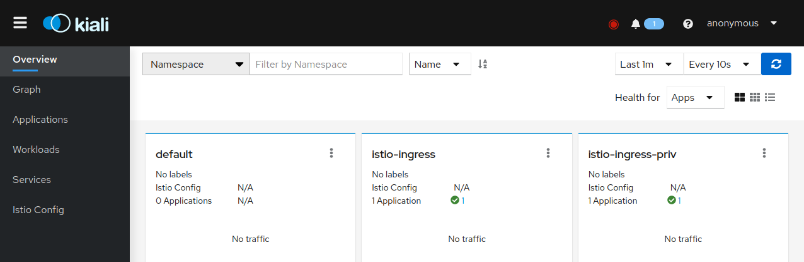
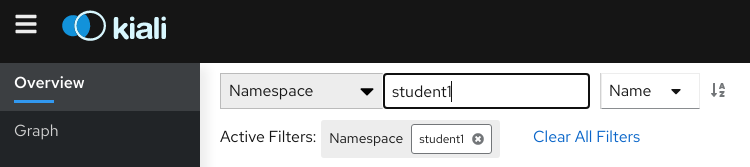
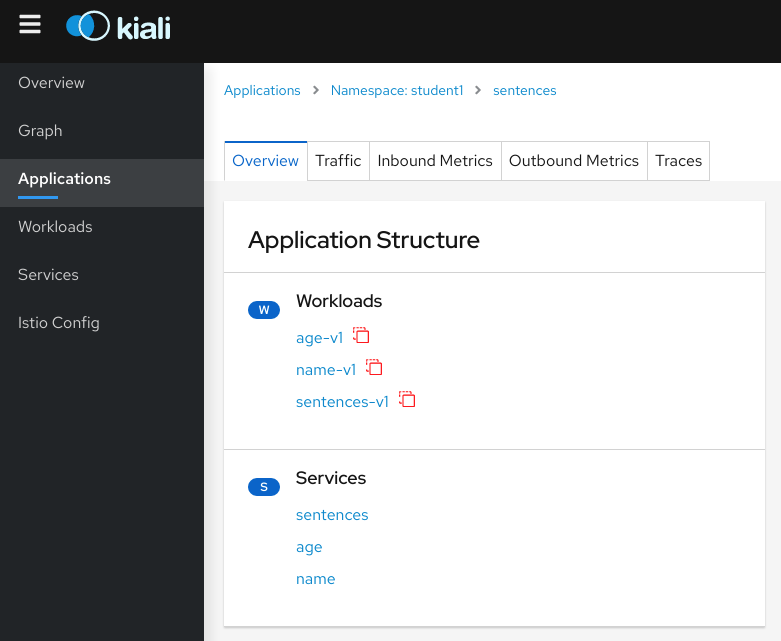
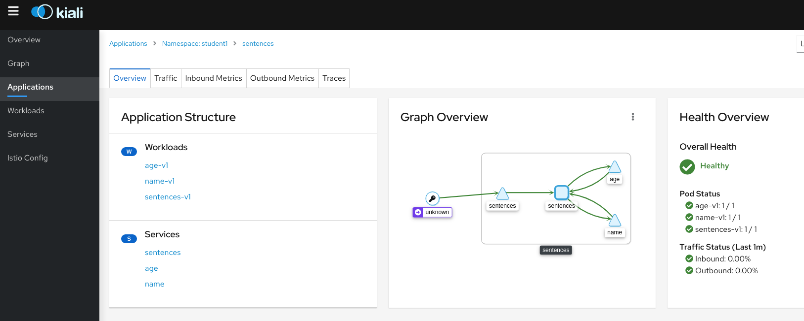
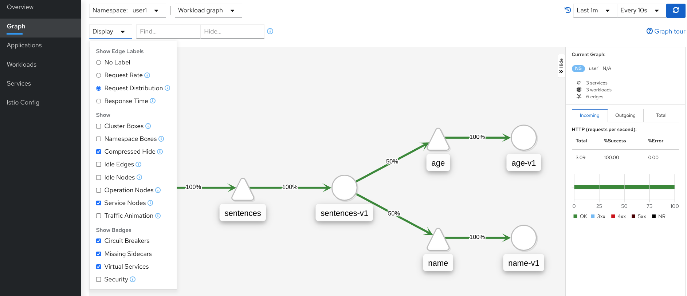

[//]: # (Copyright, Eficode )
[//]: # (Origin: https://github.com/eficode-academy/istio-katas)
[//]: # (Tags: #sentences #kiali)

# Introducing the setup

## Learning goal

- Try out the sentences application
- Add the applications traffic to the istio service mesh
- Familiarize yourself with the Kiali management console

## Introduction

This exercise introduces the sentences application which you will be using during the course.
It also introduces you to the Kiali management console for the Istio service mesh.

In the beginning of the exercise you will deploy the sentences application 
and generate traffic between the services. But there will be no Envoy sidecars 
injected and Kiali will not be able to observe the traffic.

Afterwards you will use a couple of different methods to enable sidecars. This 
will allow Kiali to observe the traffic.

<details>
    <summary> :bulb: More Info on the micro service application and Kiali </summary>

### Sentences application

This application implements a simple 'sentences' builder, which can build
sentences from the following simple algorithm:

```
age = random(0,100)
name = random(['Peter','Ray','Egon'])
return name + ' is ' + age + ' years'
```
The application is made up of three services, one which can be queried for the
random age, one which can be queried for a random name and a frontend sentence service, which
calls the two other through HTTP requests and formats the final sentences.

The source code for the application can be seen in the  [sentences-app/](sentences-app/) folder.

### Kiali

Kiali provides dashboards and observability by showing you the structure and 
health of your service mesh. It provides detailed metrics, Grafana access and 
integrates with Jaeger for distributed tracing.

One of it's most powerful features are it's graphs. They provide a powerful way 
to visualize the topology oy your service mesh. 

It provides four main graph renderings of the mesh telemetry.

* The **workload** graph provides a detailed view of communication between workloads.

* The **app** graph aggregates the workloads with the same `app` labeling, which provides a more logical view.

* The **versioned app** graph aggregates by app, but breaks out the different versions providing traffic breakdowns that are version-specific.

* The **service** graph provides a high-level view, which aggregates all traffic for defined services.



We are using Kiali to visualize the work done in this Istio course.

</details>

## Exercise: Get Familiar with Istio and Kiali.

In this exercise, we are first deploying our application with vanilla 
Kubernetes. We then visit the Kiali website to see that without a 
sidecar our service will not be included in istio.

Then you will be using a few different techniques to enable Istio sidecars 
and see the traffic flowing in Kiali.

### Overview

A general overview of what you will be doing in the **Step By Step** section.

- Deploy the sentences application services with kubectl

- Producing traffic to the sentences application

- Investigating Kiali

- Enabling sidecars with automatic sidecar injection

- Enabling sidecars with annotations

- Manually force injection of sidecars

### Step By Step

Expand the **Tasks** section below to do the exercise.

<details>
    <summary> Tasks </summary>

#### Task: Inspect your namespace

___

You will need to know your namespace for later exercises. It is provided for 
you in the environment variable `STUDENT_NS`. Check it with the following 
command.

```console
echo $STUDENT_NS
```

Execute the following command and make sure it matches the value of the 
environment variable `STUDENT_NS`.

```console
kubectl config view --output 'jsonpath={..namespace}'; echo
```

#### Task: Deploy the sentences application

___

Open a terminal in the root of the git repository (istio-katas) and use `kubectl` to deploy `v1` of the application.

```console
kubectl apply -f 00-setup-introduction/
```

#### Task: Observe the number of services and pods running

___

```console
kubectl get pod,svc
```

Once all the pods are running you should see something like. It may take a few seconds.

```
NAME                             READY   STATUS    RESTARTS   AGE
pod/age-7976688957-mbvzz         1/1     Running   0          2s
pod/name-v1-587b56cdf4-rwcwt     1/1     Running   0          2s
pod/sentences-6dffccb8c6-7fd57   1/1     Running   0          2s

NAME                TYPE        CLUSTER-IP       EXTERNAL-IP   PORT(S)          AGE
service/age         ClusterIP   172.20.123.133   <none>        5000/TCP         2s
service/name        ClusterIP   172.20.108.51    <none>        5000/TCP         2s
service/sentences   NodePort    172.20.168.218   <none>        5000:30326/TCP   2s
```

#### Task: Run the `loop-query.sh` script

___

Run the following to continuously query the sentence service and observe the output.

Do this is a **new** terminal.

```console
./scripts/loop-query.sh
```

You should see output from the shell that looks like this.

```
Using 10.0.36.130:30459, header ''
Egon is 40 years.
Ray is 16 years.
Peter is 38 years.
Peter is 19 years.
Ray is 66 years.
```

Traffic is now flowing between the services. But that **doesn't** mean it is part of the service mesh yet...

#### Task: Open Kiali and find the sentences application

___


Make sure **Namespace** is selected from the drop down at the top left and 
enter **your** namespace.



Browse to **Applications** on the left hand menu and select `sentences`.

You will see the application, workloads and services are discovered by Kiali. 
But not much else.

The red icons beside the workloads mean we have no istio sidecars deployed.
Browse the different tabs to see that there is no traffic nor metrics being captured. 
As there are no sidecars the traffic is **not** part of the istio service mesh.



#### Task: Pull sentences application down

___


```console
kubectl delete -f 00-setup-introduction/
```

#### Task: Enable automatic sidecar injection

___


```console
kubectl label namespace $STUDENT_NS istio-injection=enabled
```

#### Task: Redeploy sentences application

___


```console
kubectl apply -f 00-setup-introduction/
```

Observe the number of services and pods running.

```console
kubectl get pod,svc
```

You should see **two** containers per POD in ready state.

```
NAME                                READY   STATUS    RESTARTS   AGE
pod/age-v1-6fccc84ff-kkdgn          2/2     Running   0          4m4s
pod/name-v1-6644f45d6f-lndkm        2/2     Running   0          4m4s
pod/sentences-v1-5bbf7bcfcb-fphpp   2/2     Running   0          4m4s

NAME                TYPE        CLUSTER-IP       EXTERNAL-IP   PORT(S)          AGE
service/age         ClusterIP   172.20.228.238   <none>        5000/TCP         4m5s
service/name        ClusterIP   172.20.213.23    <none>        5000/TCP         4m4s
service/sentences   NodePort    172.20.106.197   <none>        5000:32092/TCP   4m4s
```

Run the following command to observe envoy proxy.

```console
kubectl get pods -o=custom-columns=NAME:.metadata.name,CONTAINERS:.spec.containers[*].name
```

This should show an istio proxy sidecar for each service.

```
NAME                            CONTAINERS
age-v1-676bf56bdd-m6bcj         age,istio-proxy
name-v1-587b56cdf4-6tnhs        name,istio-proxy
sentences-v1-6ccc9fdcc5-fzt2g   sentences,istio-proxy
```

#### Task: Run the loop-query.sh script

___


```console
./scripts/loop-query.sh
```

#### Task: Browse kiali and investigate the traffic flow

___


Browse to **Applications** on the left hand menu and select `sentences`.

> Remember to filter by **your** namespace.

Now you can see there are sidecars and the traffic is part of the mesh. 

- Browse the different tabs to see the traffic and metrics being captured.

> :bulb: It may take a minute before Kiali starts showing the traffic and 
> metrics. You can change the refresh rate in the top right hand corner.




#### Task: Disable automatic sidecar injection for the `age` service

___


Edit the file `00-setup-introduction/age.yaml` and add the annotation 
`sidecar.istio.io/inject: 'false'`.

```yaml
apiVersion: apps/v1
kind: Deployment
metadata:
  labels:
    app: sentences
    mode: age
    version: v1
  name: age-v1
spec:
  replicas: 1
  selector:
    matchLabels:
      app: sentences
      mode: age
      version: v1
  template:
    metadata:
      labels:
        app: sentences
        mode: age
        version: v1
      annotations:                          # Annotations block
        sidecar.istio.io/inject: 'false'    # True to enable or false to disable
    spec:
      containers:
      - image: praqma/istio-sentences:v1
        name: age
        ports:
          - containerPort: 5000
        env:
        - name: "SENTENCE_MODE"
          value: "age"
```

Apply the changes to the `age.yaml` file.

```console
kubectl apply -f 00-setup-introduction/age.yaml
```

Use kubectl to see the number of pods running.

```console
kubectl get pods
```

You should, eventually, see that the `age` service has only **one** pod. 
E.g. it no longer has a sidecar and is **not** part of the service mesh.

```
NAME                            READY   STATUS    RESTARTS   AGE
age-v1-574bfbb6b4-qb6rv         1/1     Running   0          3m50s
name-v1-795cf79f69-clrw4        2/2     Running   0          8m41s
sentences-v1-7cfbb658b6-rthxn   2/2     Running   0          8m41s
```

> Automatic sidecar injection provides a **pervasive** and homogenous approach 
> to ensuring the features istio provides. For example telemetry like metrics 
> and traces for observability. If you do not want a sidecar for a service, use 
> an **opt out** approach.

#### Task: Inject sidecar for the `age` service

___


An easy way to manually inject sidecars to services. Even if the deployment is 
annotated with false is to run the following command to inject a sidecar for 
the `age` service.

```console
cat 00-setup-introduction/age.yaml |grep -v inject | kubectl apply -f -
```

Use kubectl to see the number of pods running.

```console
kubectl get pods
```

You should now see that the `age` service has **two** pods. E.g. it has 
a sidecar and is **again** part of the service mesh.

```
NAME                            READY   STATUS    RESTARTS   AGE
age-v1-7b9f67b7dc-qxlxx         2/2     Running   0          76s
name-v1-795cf79f69-clrw4        2/2     Running   0          16m
sentences-v1-7cfbb658b6-rthxn   2/2     Running   0          16m
```

You didn't modify the static yaml with the above command. You simply took the 
output of the cat command, piped it into grep which stripped out the annotation 
and applied the **output** with kubectl.

#### Task: Investigate the different graphs

___


Browse to the **graphs** and investigate the service, workload, app 
and versioned app graphs from the drop down at the top.

> :bulb: Use the display options to modify what is shown in the 
> different graphs. Showing request distribution is something
> we will be using often. Also ensure you are running the 
> `loop-query.sh` script to generate traffic.



</details>

# Summary

In this exercise you injected sidecars with automatic sidecar injection, 
disabled sidecars with an annotation and manually injected a sidecar from 
the command line.  Manually injecting sidecars or using annotations is not 
a cohesive approach.

You were also introduced to the sentences application and Kiali. There is not 
enough time in the course to go into much more details around Kiali. But it 
has more features like the Istio Wizards feature which lets you create and 
delete istio configuration on the fly. It can do validation on the most common 
Istio objects and more. 

See the [documentation](https://kiali.io/documentation/latest/features/) 
for a more complete overview.

Main takeaways are:

* Annotations can be used to control sidecar injection.

* Automatic sidecar injections is recommended. Automatic sidecar injection 
ensures a more **pervasive** and homogenous approach for traffic management 
and observability. It is less intrusive as it happens at the pod level and 
you won't see any changes to the yaml itself.

You can find more information about the different methods 
[here](https://istio.io/latest/docs/setup/additional-setup/sidecar-injection/).

And you can find more details about sidecar configuration 
[here](https://istio.io/latest/docs/concepts/traffic-management/#sidecars).

# Cleanup

```console
kubectl delete -f 00-setup-introduction/
```
