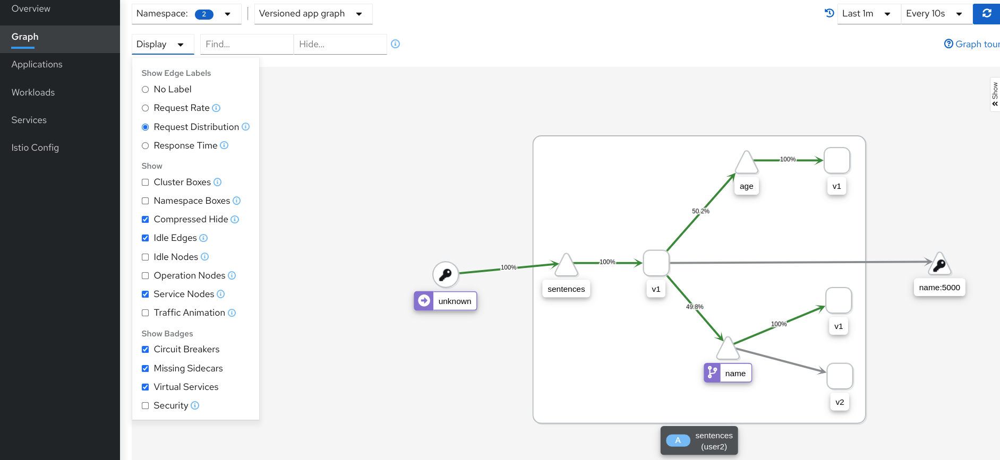
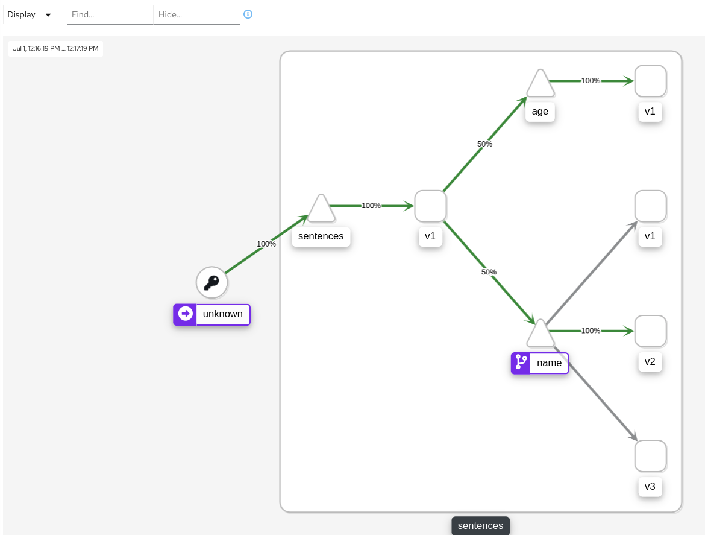
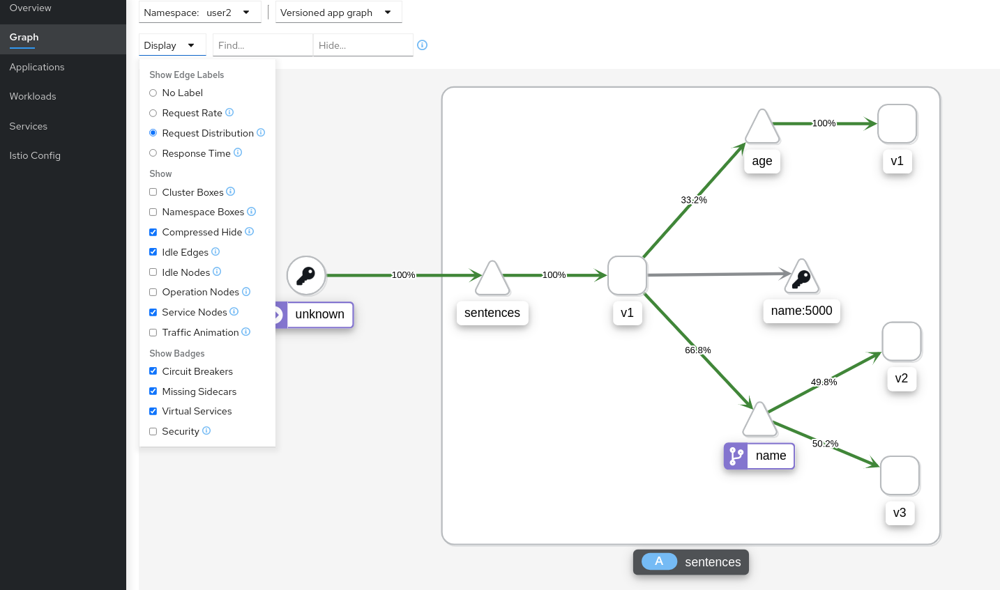
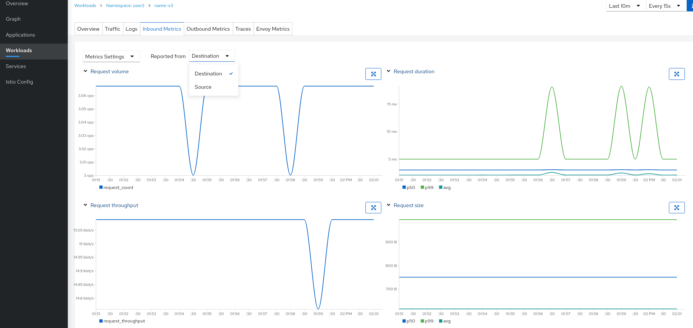

[//]: # (Copyright, Eficode )
[//]: # (Origin: https://github.com/eficode-academy/istio-katas)
[//]: # (Tags: #sentences #kiali)

# Deployment Patterns

## Learning goal

- Basic use of match criteria in a virtual service
- Use header based routing for blue/green deployment
- Use weighted traffic distribution for canary deployment
- Mirror traffic for shadow deployment

## Introduction
These exercises will introduce you to the match, weight and mirror fields of the 
HTTPRoute. These fields and their combinations can be used to enable several 
useful deployment patterns like blue/green deployments, canary deployments and 
shadow deployments.

These exercises build on the [Basic traffic routing](001-basic-traffic-routing.md) exercises.

> :bulb: If you have not completed exercise 
> [000-setup-introduction](000-setup-introduction.md) you **need** to label 
> your namespace with `istio-injection=enabled`.

## Exercise: Blue/Green Deployment 

This exercise is going to introduce you to the HTTPRoute `match` field in a 
virtual service. We want to implement a blue/green deployment pattern which 
allows the **client** to actively select a version of the **name** service 
it will hit.

```yaml
apiVersion: networking.istio.io/v1beta1
kind: VirtualService
metadata:
  name: my-service-route
spec:
  hosts:
  - my-service
  http:
  - match:
    - headers:
        my-header:
          exact: use-v2
    - route:
        - destination:
            host: my-service
            subset: v2
```

In the **example** above we define a HTTPMatchRequest with the field `match`. 
The `headers` field declares that we want to match on **request** headers. 
The `exact` field declares that the header **must** match exactly `use-v2`.

Istio allows to use other parts of **incoming** requests and match them to values 
**you** define. To see what these are expand **More Info** below.

<details>
    <summary> More Info </summary>

**Match Fields**

- **uri:** Matches the request URI to the specified value

- **schema:** Matches the request schema. (HTTP, HTTPS, ...)

- **method:** Matches the request method. (GET, POST, ...)

- **authority:** Matches the request authority header

- **header:** Matches the request headers

**NOTE:** Headers need to be **lower** cased and separated by hyphens. If 
headers is used uri, schema, method and authority are ignored.

**Match Types**

- **exact:** Exactly matches the **provided** value

- **prefix:** Only the prefix part of the **provided** value will get matched

- **regex:** The **provided** value will be matched based on the regex

**NOTE:** Istio regex's use the [re2](https://github.com/google/re2/wiki/Syntax) 
regular expression syntax

</details>

You can have multiple conditions in a match block and multiple match blocks. 

> :bulb: All conditions inside a **single** match block have **AND** semantics, 
> while the list of **match blocks** have **OR** semantics. The rule is matched 
> if any one of the match blocks succeed.

**NOTE:** Matches are evaluated **prior** to any destination's being applied.

Expand the overview below to get an idea of what you will be doing in the 
**Step By Step** section.

<details>
    <summary> Overview Of Steps </summary>

- Deploy the sentences application services 

> You will deploy two versions of the name service

- Run the `./scripts/loop-query.sh`

- Observe the traffic flow with Kiali

- Stop the `loop-query.sh`

- Add a match block with **header** condition 

> :bulb: Use the header `x-test` and a match type of **exact** with a value 
> of `use-v2`.

- Run ./scripts/loop-query.sh with the header

> :bulb: `./scripts/loop-query.sh 'x-test: use-v2'`

- Observe the traffic flow with Kiali

- Run the `loop-query.sh` **without** the header

- Observe the traffic flow with Kiali

- Remove the default route

- Observe the traffic flow with Kiali

- Add the default route and use a different header

</details>

It is **recommended** to follow the step by step tasks below.

### Step by Step

<details>
    <summary> Tasks </summary>

#### Task: Deploy the sentences app

___


```console
kubectl apply -f 002-deployment-patterns/start/
kubectl apply -f 002-deployment-patterns/start/name-v1/
kubectl apply -f 002-deployment-patterns/start/name-v2/
```

This will deploy two versions of the **name** service along with a destination 
rule and virtual service as defined in a previous exercise.

#### Task: Run the `scripts/loop-query.sh` script

___


```console
./scripts/loop-query.sh
```

#### Task: Observe the traffic flow with Kiali

___


In Kiali go to **graphs**, select **your** namespace and the 
**versioned app graph**.

You should see the traffic being routed to the `name-v1` workload because of 
the precedence of the routes in the name virtual service.


#### Task: Stop the `loop-query.sh`

___


Use `ctrl`+ `c` to stop the `loop-query.sh` script.

#### Task: Add a match block with **header** condition

___


Update the `name-vs.yaml` file with an 
[HTTPMatchRequest](https://istio.io/latest/docs/reference/config/networking/virtual-service/#HTTPMatchRequest) 
and apply it.

```yaml
apiVersion: networking.istio.io/v1beta1
kind: VirtualService
metadata:
  name: name-route
spec:
  hosts:
  - name
  exportTo:
  - "."
  gateways:
  - mesh
  http:
  - match:
    - headers:
        x-test:
          exact: use-v2
    route:
    - destination:
        host: name
        subset: name-v2
  - route:
    - destination:
        host: name
        subset: name-v1
```

```console
kubectl apply -f 002-deployment-patterns/start/name-vs.yaml
```

#### Task: Run loop-query.sh with the `x-test` header

___


```console
./scripts/loop-query.sh -h 'x-test: use-v2'
```

#### Task: Observe the traffic flow with Kiali

___


You should see all traffic being directed to `v2` of the name workload.
That is because the match evaluated to true and the route **under** the 
match block is used.


#### Task: Run the `scripts/loop-query.sh` without header

___


Use `ctrl`+ `c` to stop the `loop-query.sh` script and run it without passing 
the header.

```console
./scripts/loop-query.sh
```

#### Task: Observe the traffic flow with Kiali

___


You should now see all traffic being routed to `v1` of the name workload. 
This is because when the match did **not** evaluate to true the default 
route was used. 

> Whenever you use matches for traffic routing. You should **always** ensure you 
> have a **default** route.


> :bulb: In the file `name-vs.yaml` you created. Notice the indentation for the 
> route to `name-v1`, which is our **default** route. E.g the route to `name-v2` 
> is nested **under** the `match` block. That is a different route...

#### Task: Remove the default route

___


In the `name-vs-yaml` file remove the default route and apply the changes.

```yaml
apiVersion: networking.istio.io/v1beta1
kind: VirtualService
metadata:
  name: name-route
spec:
  hosts:
  - name
  exportTo:
  - "."
  gateways:
  - mesh
  http:
  - match:
    - headers:
        x-test:
          exact: use-v2
    route:
    - destination:
        host: name
        subset: name-v2
```

```console
kubectl apply -f 002-deployment-patterns/start/name-vs.yaml
```

#### Task: Observe the traffic flow with Kiali

___


Go to Graph menu item and select the **Versioned app graph** from the drop 
down menu.

The problem we have here is that the match is evaluated first **before** any 
destination's are applied. Since the match was not true the route defined under 
it was not applied. Nor have we provided another route to fall back on when the 
match does not evaluate to true.


#### Task: Add the default route and use a different header

___


First add the default route in the `name-vs.yaml` file again and apply it.

```yaml
apiVersion: networking.istio.io/v1beta1
kind: VirtualService
metadata:
  name: name-route
spec:
  hosts:
  - name
  exportTo:
  - "."
  gateways:
  - mesh
  http:
  - match:
    - headers:
        x-test:
          exact: use-v2
    route:
    - destination:
        host: name
        subset: name-v2
  - route:
    - destination:
        host: name
        subset: name-v1
```

```console
kubectl apply -f 002-deployment-patterns/start/name-vs.yaml
```

Now try using a different header with the value `use-v2`.

> :bulb: You can call it anything you want. For example `x-version` is used 
> below but it really doesn't matter.

```console
./scripts/loop-query.sh -h 'x-version: use-v2'
```

#### Task: Observe the traffic flow with Kiali

___


Go to Graph menu item and select the **Versioned app graph** from the drop 
down menu.

In order for a match on a header to work it **must** be propagated to all the 
services in the application tree. 

As the header is **not** propagated to the name service the default route is hit.



</details>

## Exercise: Canary Deployment

This exercise is going to introduce you to the HTTPRoute `weight` field in a 
virtual service. We want to implement a canary deployment pattern to the 
**name** service's `v1` and `v2` workloads and **header** based blue/green 
deployment to a `v3` workload.

<details>
    <summary> More Info </summary>

The canary deployment pattern is often employed **after** a blue/green deployment 
pattern. Blue/green deployments are characterized by an **explicit** 
choice by the **client/user** of which version to use. 

A canary deployment removes the need for this explicit choice by **weighting** 
the traffic between **releases**. But it is not an uncommon scenario to have a 
canary deployment alongside of a blue/green deployment for the next 
**unreleased** version.

</details>

Canary deployment is a pattern for rolling out **releases** to a **subset** 
of users/clients. The idea is to test and gather feedback from this subset and 
reduce risk by gradually introducing a new release.

> :laughing: Fun fact. The term canary comes from the coal mining industry 
> where canaries were used to alert miners when toxic gases reached dangerous 
> levels. In the same way canary deployments can alert you to issues, bad 
> design or whether features actually give the intended value.

```yaml
apiVersion: networking.istio.io/v1beta1
kind: VirtualService
metadata:
  name: my-service-route
spec:
  hosts:
  - my-service
  http:
  - route:
    - destination:
        host: my-service
        subset: v1
      weight: 90
    - destination:
        host: my-service
        subset: v2
      weight: 10
```
In the above example we define a traffic distribution percentage with the 
`weight` fields on the destinations of the HTTPRoute. The `v1` workload of 
`my-service` destination will receive 90% of **all** traffic while the `v2` 
workload of `my-service` will receive 10% of **all** traffic.

Expand the overview below to get an idea of what you will be doing in the 
**Step By Step** section.

<details>
    <summary> Overview Of Steps </summary>

- Deploy the sentences app and version `name-v3` of the name service

- Add `name-v3` subset in `name-dr.yaml`

- Adjust the `match` field header in `name-vs.yaml` to `use-v3`

- Run the `scripts/loop-query.sh`

- Observe the traffic flow with Kiali

- Add the `weight` fields in in `name-vs.yaml` to distribute traffic between `name-v1` and `name-v2`

- Observe the traffic flow with Kiali

- In a **new** terminal pass the header `x-test: use-v3` to `scripts/loop-query.sh`

- Observe the traffic flow with Kiali

- Promote `name-v2` to receive **all** traffic.

- Observe the traffic flow with Kiali

</details>

It is **recommended** to follow the step by step tasks below.

### Step By Step

<details>
    <summary> Tasks </summary>

#### Task: Deploy the sentences app with `name-v3`

___


```console
kubectl apply -f 002-deployment-patterns/start/
kubectl apply -f 002-deployment-patterns/start/name-v1/
kubectl apply -f 002-deployment-patterns/start/name-v2/
kubectl apply -f 002-deployment-patterns/start/name-v3/
```

#### Task: Add `name-v3` in `name-dr.yaml`

___


```yaml
  - name: name-v3
    labels:
      version: v3
```

```console
kubectl apply -f 002-deployment-patterns/start/name-dr.yaml
```

#### Task: Adjust the `match` field in `name-vs.yaml` to `use-v3`

___


```yaml
apiVersion: networking.istio.io/v1beta1
kind: VirtualService
metadata:
  name: name-route
spec:
  hosts:
  - name
  exportTo:
  - "."
  gateways:
  - mesh
  http:
  - match:
    - headers:
        x-test:
          exact: use-v3
    route:
    - destination:
        host: name
        subset: name-v3
  - route:
    - destination:
        host: name
        subset: name-v1
  - route:
    - destination:
        host: name
        subset: name-v2
```

> Again, notice the indentation. `name-v3` will only be hit if the header 
> match is true. The other two routes are evaluated top down.

```console
kubectl apply -f 002-deployment-patterns/start/name-vs.yaml
```

#### Task: Run `scripts/loop-query.sh`

___

If not already running, execute the `loop-query.sh` script.

```console
./scripts/loop-query.sh
```

#### Task: Observe the traffic flow with Kiali

___


Go to Graph menu item and select the **Versioned app graph** from the drop 
down menu.

The traffic should still be routed to the `v1` workload as the match condition 
did not evaluate to true and order of precedence dictates the first destination 
which will direct traffic to `v1` workload.


#### Task: Add the `weight` fields in `name-vs.yaml`

___


```yaml
apiVersion: networking.istio.io/v1beta1
kind: VirtualService
metadata:
  name: name-route
spec:
  hosts:
  - name
  exportTo:
  - "."
  gateways:
  - mesh
  http:
  - match:
    - headers:
        x-test:
          exact: use-v3
    route:
    - destination:
        host: name
        subset: name-v3
  - route:
    - destination:
        host: name
        subset: name-v1
      weight: 90
    - destination:
        host: name
        subset: name-v2
      weight: 10
```

> :bulb: The weight is distributed by **route** so the destination for `v2` must 
> be under the same route block.

```console
kubectl apply -f 002-deployment-patterns/start/name-vs.yaml
```

#### Task: Observe the traffic flow with Kiali

___


Go to Graph menu item and select the **Versioned app graph** from the drop 
down menu.

You should see that the traffic is distributed approximately 90% to `v1` and 10% 
to `v2`.


#### Task: In a **new** terminal pass the header `use-v3` to `scripts/loop-query.sh`

___


```console
./scripts/loop-query.sh -h 'x-test: use-v3'
```

#### Task: Observe the traffic flow with Kiali

___


You can see that the traffic distribution is no longer 90/10 between `v1` and `v2`.

We have two clients. One has **all** traffic routed `v3`. The others traffic is 
distributed 90% to `v1` and 10% `v2`.

The Kiali graph is showing you the percentage of the **overall** traffic. The 
weight is applied to the traffic that hits the second route.

Run `scripts/loop-query.sh` **without** the header in another terminal, or 
several, and observe how it affects the traffic distribution. You will see the 
percentage of the **overall** traffic change to look more like the 90/10 weight.


#### Task: Promote `v2` to receive all traffic

___


Stop sending traffic to `v3` with `./scripts/loop-query.sh.

Remove the `name-v1` subset from `name-dr.yaml` file.

```yaml
apiVersion: networking.istio.io/v1beta1
kind: DestinationRule
metadata:
  name: name-destination-rule
spec:
  host: name
  exportTo:
  - "."
  subsets:
  - name: name-v2
    labels:
      version: v2
  - name: name-v3
    labels:
      version: v3
```

Remove the `name-v1` destination from `name-vs.yaml` file, adjust 
the weight field to 100% on `name-v2` destination and apply changes.

```yaml
apiVersion: networking.istio.io/v1beta1
kind: VirtualService
metadata:
  name: name-route
spec:
  hosts:
  - name
  exportTo:
  - "."
  gateways:
  - mesh
  http:
  - match:
    - headers:
        x-test:
          exact: use-v3
    route:
    - destination:
        host: name
        subset: name-v3
  - route:
    - destination:
        host: name
        subset: name-v2
      weight: 100
```

```console
kubectl apply -f 002-deployment-patterns/start/name-dr.yaml
kubectl apply -f 002-deployment-patterns/start/name-vs.yaml

```

> :bulb: You could simply adjust the weight values in the 
> `name-vs.yaml` file. But for the next exercise it will cause 
> less confusion if the subsets and destinations are removed.

Finally, delete the `name-v1` workload. 

```console
kubectl delete -f 002-deployment-patterns/start/name-v1/
```

#### Task: Observe the traffic flow with Kiali

___


All traffic will now be routed to the `v2` workload. Normally you would adjust 
the weights gradually to expose `v2` to more and more users.



</details>

## Exercise: Shadow Deployment

This exercise will introduce you to the HTTPRoute `mirror` field in a virtual 
service. We want to route traffic to the **name** service `v3` workload while 
still forwarding traffic to the original destination. This is often called a 
shadow deployment.

> In Istio mirrored traffic is on a best effort basis. This means that the 
> sidecar/gateway will **not** wait for mirrored traffic **before** sending 
> a response from the original destination.

The use case here is the following. You have **completed** a canary deployment 
for `v1` and `v2` of the **name** service. You have also done a blue/green 
deployment for `v3` of the **name** service. You have tested it's functionality 
and everything looks good. Now you would like to load test `v3` as it has some 
changes that could affect performance.

<details>
    <summary> More Info </summary>

The idea behind shadow deployments is that the clients/users have no idea about 
the deployed version and the deployed version has **zero** impact on the 
clients/users as the mirrored traffic happens out of band for the critical 
request path for the primary service. 

Shadow deployments are particularly useful for load testing and refactoring of 
monolithic applications. But they can be quite complex and care has to be taken 
if there are interactions with other systems. Imagine shadow testing a payment 
service for a shopping cart. You wouldn't want users paying twice for 
an order. 

</details>

```yaml
apiVersion: networking.istio.io/v1beta1
kind: VirtualService
metadata:
  name: my-service-route
spec:
  hosts:
  - my-service
  http:
  - route:
    - destination:
        host: my-service
        subset: v2
      weight: 100
    - destination:
        host: my-service
        subset: v3
    mirror:
      host: my-service
      subset: v3
    mirrorPercentage:
      value: 100.0
```
In the example above you can see that the `weight` field routes 100% of traffic 
to the `v2` subset of `my-service`. The `mirror` field will route 100% of the 
traffic `v2` receives to the `v3` subset. 


Adjusting the `mirrorPercentage` value will adjust how much of the traffic 
routed to `v2` will be mirrored to the `v3` subset. E.g, if set to 50.0 then 
50% percent of traffic routed to the `v2` subset will be mirrored to the `v3` subset. 

If the field is not defined then the `v3` subset will get 100% of the traffic 
routed to `v2`.

Expand the overview below to get an idea of what you will be doing in the 
**Step By Step** section.

<details>
    <summary> Overview Of Steps </summary>

- Remove the `match` block from `name-vs.yaml`

- Add the `mirror` blocks to `name-vs.yaml`

- Apply the changes to `name-vs.yaml`

- Run `scripts/loop-query.sh`

- Inspect the `name-v3` workload to see if it is receiving traffic

- Observe the traffic in Kiali

</details>

It is **recommended** to follow the step by step tasks below.

### Step By Step

<details>
    <summary> Tasks </summary>

#### Task: Remove the `match` block from `name-vs.yaml`

___


```yaml
apiVersion: networking.istio.io/v1beta1
kind: VirtualService
metadata:
  name: name-route
spec:
  hosts:
  - name
  exportTo:
  - "."
  gateways:
  - mesh
  http:
  - route:
    - destination:
        host: name
        subset: name-v2
      weight: 100
```

#### Task: Add the `mirror` blocks in `name-vs.yaml`

___


```yaml
apiVersion: networking.istio.io/v1beta1
kind: VirtualService
metadata:
  name: name-route
spec:
  hosts:
  - name
  exportTo:
  - "."
  gateways:
  - mesh
  http:
  - route:
    - destination:
        host: name
        subset: name-v2
      weight: 100
    mirror:
      host: name
      subset: name-v3
    mirrorPercentage:
      value: 100.0
```

#### Task: Apply the changes to `name-vs.yaml`

___


```console
kubectl apply -f 002-deployment-patterns/start/name-vs.yaml
```

#### Task: Run `scripts/loop-query.sh`

___


```console
./scripts/loop-query.sh
```

You should **only** see responses from the `name-v2` workload. It should look 
something like the following.

```console
Porthos (v2) is 82 years
Athos (v2) is 42 years
Athos (v2) is 85 years
Athos (v2) is 16 years
d'Artagnan (v2) is 57 years
Porthos (v2) is 99 years
Porthos (v2) is 34 years
Athos (v2) is 92 years
Porthos (v2) is 11 years
Athos (v2) is 75 years
```
> Requests mirrored to the `name-v3` workload are done as **fire and forget** 
> requests. All **responses** are discarded.

#### Task: Inspect the `name-v3` workload to see if it is receiving traffic

___


```console
export NAME_V3_POD=$(kubectl get pod -l app=sentences,version=v3 -o jsonpath={.items..metadata.name})
kubectl logs "$NAME_V3_POD" --tail=20 --follow
```

You should see GET requests hitting the `name-v3` workload. It should look 
something like this.

```console
WARNING:root:Using name 'd'Artagnan (v3)'
WARNING:root:Operation 'name' took 0.171ms
127.0.0.1 - - [01/Jul/2021 14:18:13] "GET / HTTP/1.1" 200 -
INFO:werkzeug:127.0.0.1 - - [01/Jul/2021 14:18:13] "GET / HTTP/1.1" 200 -
WARNING:root:Using name 'Porthos (v3)'
WARNING:root:Operation 'name' took 0.160ms
127.0.0.1 - - [01/Jul/2021 14:18:13] "GET / HTTP/1.1" 200 -
INFO:werkzeug:127.0.0.1 - - [01/Jul/2021 14:18:13] "GET / HTTP/1.1" 200 -
WARNING:root:Using name 'Athos (v3)'
WARNING:root:Operation 'name' took 0.238ms
127.0.0.1 - - [01/Jul/2021 14:18:14] "GET / HTTP/1.1" 200 -
```

#### Task: Observe the traffic in Kiali

___


Go to Graph menu item and select the **Versioned app graph** from the drop 
down menu.

If you look at the **version app graph** you **will** see the mirrored 
traffic being shown.



But you know that the client is **not** getting 
responses from `v3` from the terminals output.

```console
Porthos (v2) is 82 years
Athos (v2) is 42 years
Athos (v2) is 85 years
Athos (v2) is 16 years
d'Artagnan (v2) is 57 years
Porthos (v2) is 99 years
Porthos (v2) is 34 years
Athos (v2) is 92 years
Porthos (v2) is 11 years
Athos (v2) is 75 years
```

Go to the menu item **Workloads** and select `name-v3` and the **inbound** 
metrics tab. 

Metrics are also collected for the **destination** traffic of `v3`. If you 
select **Source** from the **Reported from** drop down you will **not** 
see any metrics as responses are discarded. 



</details>


# Summary

In these exercises you learned some of functionality provided by Istio's HTTPRoute.
Implementing blue/green, canary and shadow deployment patterns. But there is a lot 
more you can do. You can also manipulate headers, do HTTP redirects, 
HTTP rewrites, etc. 

See the [documentation](https://istio.io/latest/docs/reference/config/networking/virtual-service/#VirtualService) 
for a more complete overview of what you can do.

The main takeaways are:

* Istio enables you to apply various deployment patterns inside the mesh

* The match field is quite powerful

* You should always provide a default route when using a match

* The **application** MUST propagate the headers in order for the virtual 
service to work with it

# Cleanup

```console
kubectl delete -f 002-deployment-patterns/start/name-v3
kubectl delete -f 002-deployment-patterns/start/name-v2
kubectl delete -f 002-deployment-patterns/start/name-v1
kubectl delete -f 002-deployment-patterns/start/

```
