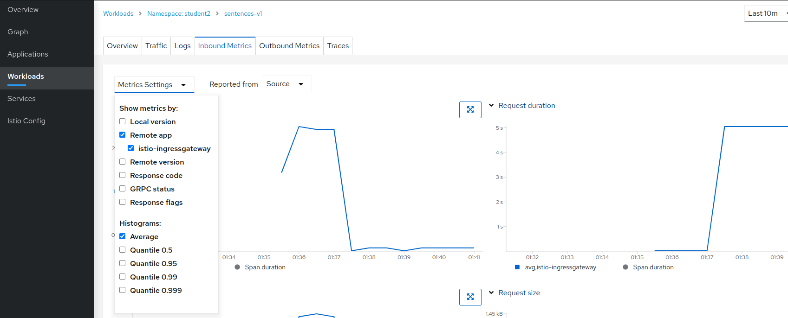

[//]: # (Copyright, Eficode )
[//]: # (Origin: https://github.com/eficode-academy/istio-katas)
[//]: # (Tags: #sentences #kiali)

# Getting traffic into the mesh

## Learning goals

- Understand Istio gateways (Ingress)

## Introduction

These exercises will introduce you to Istio concepts 
and ([CRD's](https://kubernetes.io/docs/concepts/extend-kubernetes/api-extension/custom-resources/)) 
for configuring traffic **into** the service mesh. This is commonly called 
Ingress traffic. 

Istio does support 
[Kubernetes Ingress](https://istio.io/latest/docs/tasks/traffic-management/ingress/kubernetes-ingress/) 
but also offers another configuration model.

The Istio [IngressGateway](https://istio.io/latest/docs/tasks/traffic-management/ingress/ingress-control/) 
which is what you will be using in this exercise.

<details>
    <summary> More Info </summary>

An Istio gateway **describes** a load balancer operating at the **edge** 
of the mesh receiving incoming or outgoing **HTTP/TCP** connections. The 
specification describes the ports to be expose, type of protocol, 
configuration for the load balancer, etc.

An Istio **IngressGateway** in a Kubernetes cluster consists, at a minimum, 
of a Deployment and a Service. Istio ingress gateways are based on the Envoy 
and have a **standalone** Envoy proxy. 

Inspecting our course environment would show something like:

```console
NAME                                        TYPE                                   
istio-ingressgateway                        deployment  
istio-ingressgateway                        service
istio-ingressgateway-69c77d896c-5vvjg       pod
```

Inspecting the POD would show something like:

```console
NAME                                    CONTAINERS
istio-ingressgateway-69c77d896c-5vvjg   istio-proxy
```

This is the IngressGateway which we configure with a Gateway CRD.

</details>

> :bulb: If you have not completed exercise 
> [000-setup-introduction](000-setup-introduction.md) you **need** to label 
> your namespace with `istio-injection=enabled`.

## Exercise: Ingress Traffic With Gateway

The previous exercises used a Kubernetes **NodePort** service to get traffic 
to the sentences service. E.g. the **ingress** traffic to `sentences` **was 
not** flowing through the Istio service mesh. 

From the `sentences` service to the `age` and `name` services traffic **was** 
flowing through the Istio service mesh. We know this to be true because we 
have applied virtual services and destination rules to the `name` service.

Ingressing traffic directly from the Kubernetes cluster network to a frontend
service means that Istio features **cannot** be applied on this part of the 
traffic flow.

In this exercise you are going rectify this by **configuring** 
ingress traffic to the sentences service through a dedicated 
**IngressGateway** (`istio-ingressgateway`) provided by 
**Istio** instead of a Kubernetes NodePort. Furthermore you 
are going to introduce a fixed delay to demonstrate that you can 
now apply Istio traffic management to the sentences service.

You are going to do this using the 
[Gateway](https://istio.io/latest/docs/reference/config/networking/gateway/#Gateway) 
CRD.

```yaml
apiVersion: networking.istio.io/v1beta1
kind: Gateway
metadata:
  name: myapp-gateway
spec:
  selector:
    app: istio-ingressgateway
    istio: ingressgateway
  servers:
  - port:
      number: 80
      name: http
      protocol: HTTP
    hosts:
    - "myapp.example.com"
```
> Don't confuse the the **IngressGateway** with the Gateway custom resource 
> definition. The gateway CRD is used to **configure** the Ingressgateway.

The servers block is where you define the port configurations, protocol 
and the hosts exposed by the gateway. A host entry is specified as a dnsName 
and should be specified using the FQDN format. 

> You can use a wildcard character in the **left-most** component of the 
> `hosts`field. E.g. `*.example.com`. You can also **prefix** the `hosts` field 
> with a namespace. 
> See the [documentation](https://istio.io/latest/docs/reference/config/networking/gateway/#Server) 
> for more details.

The **selectors** above are the labels on the `istio-ingressgateway` POD which 
is running a standalone Envoy proxy.

The gateway defines and **entry point** to be exposed in the 
`istio-ingressgateway`. That is it. Nothing else. This entry point knows 
nothing about how to route the traffic to the desired destination within the 
mesh. 

In order to route the traffic we, of course, use a virtual service. 

```yaml
apiVersion: networking.istio.io/v1beta1
kind: VirtualService
metadata:
  name: myapp
spec:
  hosts:
  - "myapp.example.com"
  gateways:
  - myapp-gateway
  http:
  - route:
    - destination:
        host: myapp-frontend
```

Note how it specifies the hostname and the name of the gateway 
(in `spec.gateways`). A gateway definition can define an entry for many 
hostnames and a VirtualService can be bound to multiple gateways, i.e. these 
are not necessarily related one-to-one.

Expand the overview below to get an idea of what you will be doing in the 
**Step By Step** section.

<details>
    <summary> Overview Of Steps </summary>

- Deploy the `sentences-v1` service with name and age services

- Create an entry point for the sentences service

> :bulb: The FQDN you will use should be 
> `<YOUR_NAMESPACE>.sentences.istio.eficode.academy`.

- Create a route from the entry point to the sentences service

- Run the loop query script with the `-g` option and FQDN

- Observe the traffic flow with Kiali

- Add a fixed delay to the sentences service

- Observe the traffic flow with Kiali

</details>

It is **recommended** to follow the step by step **tasks** below.

### Step by Step

<details>
    <summary> Tasks </summary>

#### Task: Deploy the sentences-v1 service with name and age services

___


> :bulb: This exercise **requires** that you know the namespace you are 
> working in. If you do not know you can inspect your namespace with the 
> following command.

```console
kubectl config view --output 'jsonpath={..namespace}'; echo
```

Deploy the sentences application services.

```console
kubectl apply -f 003-ingress-traffic/start/
```

#### Task: Create an entry point for the sentences service

___


Create a file called `sentences-ingress-gw.yaml` in 
`003-ingress-traffic/start` directory.

It should look like the below yaml. 

> :bulb: Replace <YOUR_NAMESPACE> in the yaml below with the namespace you 
> have been assigned in this course. Otherwise you might not hit the 
> `sentence` service in your namespace.

```yaml
apiVersion: networking.istio.io/v1beta1
kind: Gateway
metadata:
  name: sentences
spec:
  selector:
    app: istio-ingressgateway
    istio: ingressgateway
  servers:
  - port:
      number: 80
      name: http
      protocol: HTTP
    hosts:
    - "<YOUR_NAMESPACE>.sentences.istio.eficode.academy"
```

Apply the resource:

```console
kubectl apply -f 003-ingress-traffic/start/sentences-ingress-gw.yaml
```

#### Task: Create a route from the gateway to the sentences service

___


Create a file called `sentences-ingress-vs.yaml` in 
`003-ingress-traffic/start` directory.

```yaml
apiVersion: networking.istio.io/v1beta1
kind: VirtualService
metadata:
  name: sentences
spec:
  hosts:
  - "<YOUR_NAMESPACE>.sentences.istio.eficode.academy"
  gateways:
  - sentences
  http:
  - route:
    - destination:
        host: sentences
```

The VirtualService routes all traffic for the given hostname
to the `sentences` service (the two last lines specifying the Kubernetes
`sentences` service as destination).

Apply the resource:

```console
kubectl apply -f 003-ingress-traffic/start/sentences-ingress-vs.yaml
```

#### Task: Run the loop query script with the `hosts` entry

___


The sentence service we deployed in the first step has a type of `ClusterIP` 
now. In order to reach it we will need to go through the `istio-ingressgateway`. 

Run the `loop-query.sh` script with the option `-g` and pass it the `hosts` entry.

```console
./scripts/loop-query.sh -g <YOUR_NAMESPACE>.sentences.istio.eficode.academy
```

#### Task: Observe the traffic flow with Kiali

___


Go to Graph menu item and select the **Versioned app graph** from the drop 
down menu.

Now we can see that the traffic to the `sentences` service is no longer 
**unknown** to the service mesh. 


#### Task: Add a fixed delay to the sentences service

___


To demonstrate that we can now apply Istio traffic management to the 
sentences service. Add a fixed delay of 5 seconds to the 
`sentences-ingress-vs.yaml` file you created.

```yaml
apiVersion: networking.istio.io/v1beta1
kind: VirtualService
metadata:
  name: sentences
spec:
  hosts:
  - "<YOUR_NAMESPACE>.sentences.istio.eficode.academy"
  gateways:
  - sentences
  http:
  - fault:
      delay:
        fixedDelay: 5s
        percentage:
          value: 100
    route:
    - destination:
        host: sentences
```

Apply the changes.

```console
kubectl apply -f 003-ingress-traffic/start/sentences-ingress-vs.yaml
```

You should see that the response in the terminal are now taking 
approximately five seconds each.

#### Task: Observe the traffic flow with Kiali

___


Go to **Workloads** menu item, select `sentences-v1` workload and the 
**Inbound Metrics** tab, **Reported from** in the **Source** drop down 
menu and select checkboxes as shown in the below image. 



It may take a little bit before the graph updates but, eventually, you 
should see that the request duration is trending towards fve seconds.

</details>

# Summary

In this exercise you saw how to route incoming traffic through an ingress gateway. 
This allows you to apply istio traffic management features to the sentences 
service. For example, you could do a blue/green deploy of two different versions 
of the sentence service.

Istio's default installation provide it's own configuration model (Gateway) 
for ingress traffic while also supporting Kubernetes ingress. The Istio  
gateway consists a deployment, a service and a **standalone** envoy proxy.

> The ingress gateway we used in our training environment is located in the 
> `istio-ingress` namespace.

The main takeaways are:

* When you defined the gateway CRD for your namespace you configured an entry 
point in the stand alone envoy proxy

* If traffic is not flowing through the mesh, e.g through the envoy sidecars, 
then you cannot leverage Istio features, e.g. the traffic between the gateway 
and your front end service

# Cleanup

```console
kubectl delete -f 003-ingress-traffic/start/
```
