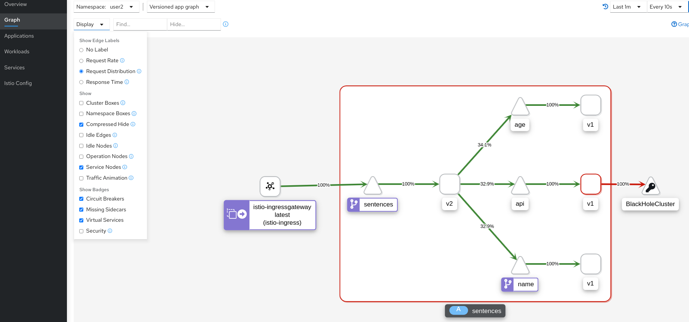
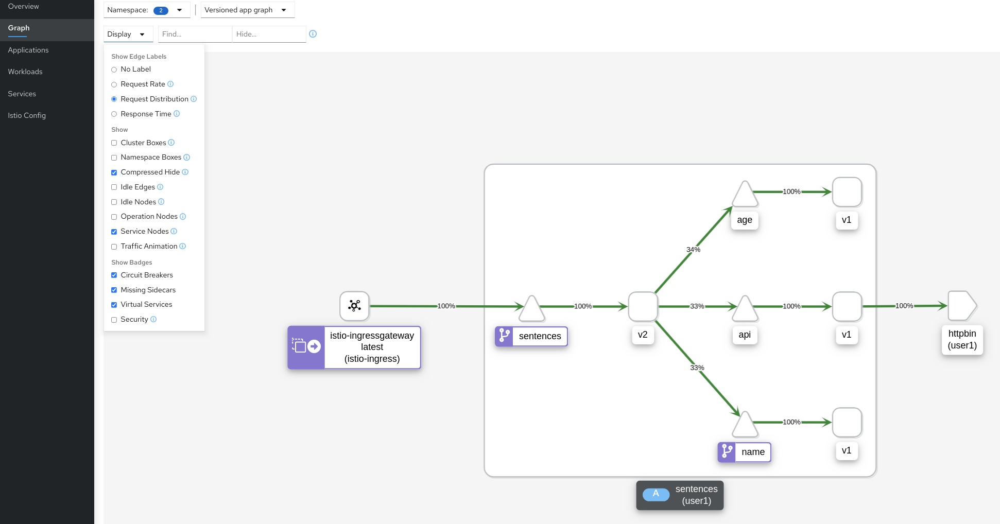

[//]: # (Copyright, Eficode )
[//]: # (Origin: https://github.com/eficode-academy/istio-katas)
[//]: # (Tags: #sentences #kiali)

# Traffic in and out of mesh

## Learning goals

- Understand Istio gateways (ingress)
- Understand how to access external services
- Understand Istio gateways (egress)

## Introduction

These exercises will introduce you to Istio concepts 
and ([CRD's](https://kubernetes.io/docs/concepts/extend-kubernetes/api-extension/custom-resources/)) 
for configuring traffic **into** the service mesh (Ingress) and **out** of the 
service mesh (Egress). 

You will use two Istio CRD's for this. The **Gateway** and the **ServiceEntry** 
CRD's. 

In the first exercise you will deploy the sentences application and configure 
traffic **into** the mesh and on to the sentences service **through** an 
ingress gateway. You will also apply some Istio traffic management to 
this route.

In the next exercise you will deploy a **new** version (`v2`) of the 
**sentences** application. This version talks to a **new** api service 
which communicates to an api **outside** of the cluster, e.g. an 
external service.

In the final exercise you will route the traffic from the **new** api service 
through a common Egress gateway.

## Exercise: Ingress Traffic With Gateway

The previous exercises used a Kubernetes **NodePort** service to get traffic 
to the sentences service. E.g. the **ingress** traffic to `sentences` **was 
not** flowing through the Istio service mesh. 

From the `sentences` service to the `age` and `name` services traffic **was** 
flowing through the Istio service mesh. We know this to be true because we 
have applied virtual services and destination rules to the `name` service.

Ingressing traffic directly from the Kubernetes cluster network to a frontend
service means that Istio features **cannot** be applied on this part of the 
traffic flow.

<details>
    <summary> More Info </summary>

A Gateway **describes** a load balancer operating at the **edge** of the mesh 
receiving incoming or outgoing **HTTP/TCP** connections. The specification 
describes the ports to be expose, type of protocol, configuration for the 
load balancer, etc.

An Istio **Ingress** gateway in a Kubernetes cluster consists, at a minimum, of a 
Deployment and a Service. Istio ingress gateways are based on the Envoy and have a 
**standalone** Envoy proxy. 

Inspecting our course environment would show something like:

```console
NAME                                        TYPE                                   
istio-ingressgateway                        deployment  
istio-ingressgateway                        service
istio-ingressgateway-69c77d896c-5vvjg       pod
```

Inspecting the POD would show something like:

```console
NAME                                    CONTAINERS
istio-ingressgateway-69c77d896c-5vvjg   istio-proxy
```

</details>

In this exercise you are going rectify this by **configuring** 
ingress traffic to the sentences service through a dedicated 
**ingress** gateway (`istio-ingressgateway`) provided by 
**Istio** instead of a Kubernetes NodePort. Furthermore you 
are going to introduce a fixed delay to demonstrate that you can 
now apply Istio traffic management to the sentences service.

You are going to do this by defining a gateway.

```yaml
apiVersion: networking.istio.io/v1beta1
kind: Gateway
metadata:
  name: myapp-gateway
spec:
  selector:
    app: istio-ingressgateway
    istio: ingressgateway
  servers:
  - port:
      number: 80
      name: http
      protocol: HTTP
    hosts:
    - "myapp.example.com"
```

The servers block is where you define the port configurations, protocol 
and the hosts exposed by the gateway. A host entry is specified as a dnsName 
and should be specified using the FQDN format. 

> You can use a wildcard character in the **left-most** component of the 
> `hosts`field. E.g. `*.example.com`. You can also **prefix** the `hosts` field 
> with a namespace. 
> See the [documentation](https://istio.io/latest/docs/reference/config/networking/gateway/#Server) 
> for more details.

The **selectors** above are the labels on the `istio-ingressgateway` POD which 
is running a standalone Envoy proxy.

The gateway defines and **entry point** to be exposed in the 
`istio-ingressgateway`. That is it. Nothing else. This entry point knows 
nothing about how to route the traffic to the desired destination within the 
mesh. In order to route the traffic we, of course, use a virtual service. 

```yaml
apiVersion: networking.istio.io/v1beta1
kind: VirtualService
metadata:
  name: myapp
spec:
  hosts:
  - "myapp.example.com"
  gateways:
  - myapp-gateway
  http:
  - route:
    - destination:
        host: myapp-frontend
```

Note how it specifies the hostname and the name of the gateway 
(in `spec.gateways`). A gateway definition can define an entry for many 
hostnames and a VirtualService can be bound to multiple gateways, i.e. these 
are not necessarily related one-to-one.

### Overview

- Deploy the `sentences-v1` service with name and age services

- Create an entry point for the sentences service

> :bulb: The FQDN you will use should be 
> `<YOUR_NAMESPACE>.sentences.istio.eficode.academy`.

- Create a route from the entry point to the sentences service

- Run the loop query script with the `-g` option and FQDN

- Observe the traffic flow with Kiali

- Add a fixed delay to the sentences service

- Observe the traffic flow with Kiali

### Step by Step
<details>
    <summary> More Details </summary>

- **Deploy the sentences-v1 service with name and age services**

```console
kubectl apply -f 003-traffic-in-out-mesh/start/
kubectl apply -f 003-traffic-in-out-mesh/start/sentences-v1/
```

- **Create an entry point for the sentences service**

Create a file called `sentences-ingress-gw.yaml` in 
`003-traffic-in-out-mesh/start` directory.

It should look like the below yaml. 

> :bulb: Replace <YOUR_NAMESPACE> in the yaml below with the namespace you 
> have been assigned in this course. Otherwise you might not hit the 
> `sentence` service in your namespace.

```yaml
apiVersion: networking.istio.io/v1beta1
kind: Gateway
metadata:
  name: sentences
spec:
  selector:
    app: istio-ingressgateway
    istio: ingressgateway
  servers:
  - port:
      number: 80
      name: http
      protocol: HTTP
    hosts:
    - "<YOUR_NAMESPACE>.sentences.istio.eficode.academy"
```

Apply the resource:

```console
kubectl apply -f 003-traffic-in-out-mesh/start/sentences-ingress-gw.yaml
```

- **Create a route from the gateway to the sentences service**

Create a file called `sentences-ingress-vs.yaml` in 
`003-traffic-in-out-mesh/start` directory.

```yaml
apiVersion: networking.istio.io/v1beta1
kind: VirtualService
metadata:
  name: sentences
spec:
  hosts:
  - "<YOUR_NAMESPACE>.sentences.istio.eficode.academy"
  gateways:
  - sentences
  http:
  - route:
    - destination:
        host: sentences
```

The VirtualService routes all traffic for the given hostname
to the `sentences` service (the two last lines specifying the Kubernetes
`sentences` service as destination).

Apply the resource:

```console
kubectl apply -f 003-traffic-in-out-mesh/start/sentences-ingress-vs.yaml
```

- **Run the loop query script with the `hosts` entry**

The sentence service we deployed in the first step has a type of `ClusterIP` 
now. In order to reach it we will need to go through the `istio-ingressgateway`. 

Run the `loop-query.sh` script with the option `-g` and pass it the `hosts` entry.

```console
./scripts/loop-query.sh -g <YOUR_NAMESPACE>.sentences.istio.eficode.academy
```

- **Observe the traffic flow with Kiali**

Go to Graph menu item and select the **Versioned app graph** from the drop 
down menu.

Now we can see that the traffic to the `sentences` service is no longer 
**unknown** to the service mesh. 


- **Add a fixed delay to the sentences service**

To demonstrate that we can now apply Istio traffic management to the 
sentences service. Add a fixed delay of 5 seconds to the 
`sentences-ingress-vs.yaml` file you created.

```yaml
apiVersion: networking.istio.io/v1beta1
kind: VirtualService
metadata:
  name: sentences
spec:
  hosts:
  - "user2.sentences.istio.eficode.academy"
  gateways:
  - sentences
  http:
  - fault:
      delay:
        fixedDelay: 5s
        percentage:
          value: 100
    route:
    - destination:
        host: sentences
```

You should see that the response in the terminal are now taking 
approximately five seconds each.

- **Observe the traffic flow with Kiali**

Go to **Workloads** menu item, select the **Inbound Metrics** tab, 
**Reported from** in the **Source** drop down menu and select checkboxes 
as shown in the below image. 


It may take a little bit before the graph updates bu you should see 
that the request duration is trending towards fve seconds.

</details>

## Exercise: Egress Traffic With Service Entry

In this exercise you will deploy a **new** version of the **sentences** 
service. This new version will use a new **API** service which does nothing 
more than make a call to [httpbin](https://httpbin.org/) asking for a delay 
of 1 second for responses. You will then define a ServiceEntry to allow 
traffic to the external service.

> :bulb: In our environment we have set the outBoundTrafficPolicy to 
> `REGISTRY_ONLY`. See **More Info** below.

<details>
    <summary> More Info </summary>

By default, Istio configures Envoy proxies to **passthrough** requests to 
unknown services. So, technically they are not required. But without them 
you can't apply Istio features. 

There is also the security aspect to consider. While securely controlling 
ingress traffic is the highest priority, it is good policy to securely control 
egress traffic also. As part of this many clusters will have the 
`outBoundTrafficPolicy` set to `REGISTRY_ONLY` as is done in our cluster. 
This will force you to define your external services with a service entry.

When you create a service entry it is added to Istio's internal service 
registry and traffic is allowed out of the mesh to the defined destination. 

Istio maintains an internal service registry containing the set of services, 
and their corresponding service endpoints, running in a service mesh. 
Istio uses the service registry to generate Envoy configuration.

Istio does not provide service discovery, although most services are 
automatically added to the registry by Pilot adapters that reflect the 
discovered services of the underlying platform (Kubernetes, Consul, plain DNS). 
Additional services can also be registered manually using a ServiceEntry 
configuration.

</details>

A ServiceEntry allows you to apply Istio traffic management for services 
running **outside** of your mesh. Your service might use an external API 
as an example. Once you have defined a service entry you can configure 
virtual services and destination rules to apply Istio features like 
redirecting or forwarding traffic to external destinations, defining 
retries, timeouts and fault injection policies. 

```yaml
apiVersion: networking.istio.io/v1beta1
kind: ServiceEntry
metadata:
  name: external-api
spec:
  hosts:
  - external-api.example.com
  exportTo:
  - "."
  ports:
  - number: 80
    name: http-port
    protocol: HTTP
  - number: 443
    name: https-port
    protocol: HTTPS
  resolution: DNS
```

The `hosts` field is used to select matching `hosts` in virtual services 
and destination rules. The `resolution` field is used to determine how the 
proxy will resolve IP addresses of the end points. The `exportTo` field scopes 
the service entry to the namespace where it is defined.

> :bulb: The `exportTo` field is important for this exercise. **Not** 
> scoping the service entry to your namespace will open the external 
> service for **all** attendees. 

### Overview

- Delete the sentences `v1` deployment and deploy `v2` and api

- Run the loop query script with the `hosts` entry

- Observe the response for the external service

- Observe the traffic flow with Kiali

- Define a service entry for httpbin.org and apply it

- Observe the traffic flow with Kiali

- Create a virtual service with a timeout of 3 seconds

- Observe the traffic flow with Kiali

### Step by Step
<details>
    <summary> More Details </summary>

- **Delete the sentences `v1` deployment and deploy `v2` and api**

First stop the loop-query.sh execution. Then delete `v1` of sentences service 
and deploy `v2` of the sentences service and `v1` of the api service.

```console
kubectl delete -f 003-traffic-in-out-mesh/start/sentences-v1/
kubectl apply -f 003-traffic-in-out-mesh/start/sentences-v2/
kubectl apply -f 003-traffic-in-out-mesh/start/api-v1/
kubectl apply -f 003-traffic-in-out-mesh/start/
```

- **Run the loop query script with the `hosts` entry**

```console
./scripts/loop-query.sh -g <YOUR_NAMESPACE>.sentences.istio.eficode.academy
```

- **Observe the responses for the external service**

Export the pod as an environment variable and tail the logs.

```console
export API_POD=$(kubectl get pod -l app=sentences,mode=api -o jsonpath={.items..metadata.name})
kubectl logs "$API_POD" --tail=20 --follow
```

You should see a response of 502(Bad Gateway) because there exists no service entry for 
the external service httpbin.

```console
INFO:werkzeug:127.0.0.1 - - [10/Aug/2021 12:07:41] "GET / HTTP/1.1" 200 -
WARNING:root:Response was: 502                      <-------------------- Bad Gateway Response
WARNING:root:Operation 'api' took 306.376ms
```

- **Observe the traffic flow with Kiali**

Go to Graph menu item and select the **Versioned app graph** from the drop 
down menu.



As there is no service entry all traffic to the external service is blocked 
and it is a **black hole** to the service mesh.

- **Define a service entry for httpbin.org**

Create a service entry called `api-egress-se.yaml`in 
`003-traffic-in-out-mesh/start/`.

```yaml
apiVersion: networking.istio.io/v1beta1
kind: ServiceEntry
metadata:
  name: api-egress-se
spec:
  hosts:
  - httpbin.org
  exportTo:
  - "."
  ports:
  - number: 80
    name: http-port
    protocol: HTTP
  - number: 443
    name: https-port
    protocol: HTTPS
  resolution: DNS
```

Apply the service entry.

```console
kubectl apply -f 003-traffic-in-out-mesh/start/api-egress-se.yaml
```

- **Observe the responses for the external service**

Export the pod as an environment variable and tail the logs.

```console
export API_POD=$(kubectl get pod -l app=sentences,mode=api -o jsonpath={.items..metadata.name})
kubectl logs "$API_POD" --tail=20 --follow
```

Now you should be getting a 200(OK) response from the external service. 

```console
INFO:werkzeug:127.0.0.1 - - [10/Aug/2021 12:21:14] "GET / HTTP/1.1" 200 -
WARNING:root:Response was: 200                <-------------------- OK Response
WARNING:root:Operation 'api' took 374.259ms
```

- **Observe the traffic flow with Kiali**

Go to Graph menu item and select the **Versioned app graph** from the drop 
down menu.



Now Kiali recognizes the external service because of the service entry and it 
is no longer a black hole.

- **Create a virtual service with a timeout of 0.5 seconds**

Basically all we have done so far is to add an entry for httpbin to Istio's 
internal service registry. But we can now apply some of the Istio features to 
external service. To demonstrate this you will create a virtual service for 
traffic to httpbin with a timeout tof `0.5s`.

> The api service asks httpbin.org for a response delay of 1 second.

Create a file called `api-egress-vs.yaml` in 
`003-traffic-in-out-mesh/start/`.

```yaml
apiVersion: networking.istio.io/v1beta1
kind: VirtualService
metadata:
  name: api-egress-vs
spec:
  hosts:
    - httpbin.org
  exportTo:
  - "."
  http:
  - timeout: 0.5s
    route:
      - destination:
          host: httpbin.org
        weight: 100
```

Apply the virtual service.

```console
kubectl apply -f 003-traffic-in-out-mesh/start/api-egress-vs.yaml
```

- **Observe the responses for the external service**

Export the pod as an environment variable and tail the logs.

```console
export API_POD=$(kubectl get pod -l app=sentences,mode=api -o jsonpath={.items..metadata.name})
kubectl logs "$API_POD" --tail=20 --follow
```

Now you should be getting a 504(Gateway Timeout) response from the external service. 

```console
INFO:werkzeug:127.0.0.1 - - [10/Aug/2021 13:29:11] "GET / HTTP/1.1" 200 -
WARNING:root:Response was: 504                <-------------------- 504 Gateway Timeout
WARNING:root:Operation 'api' took 504.809ms
```

</details>

## Exercise: Egress Traffic With Gateway

In a previous exercise you configured Istio to allow access to an external 
service([httpbin](http://httpbin.org)). You then applied a service entry and 
a simple virtual service with a timeout to prove that Istio traffic management 
features can be applied.

In the above case the traffic was flowing directly from the workloads Envoy 
sidecar to the external service. 

But there are use cases where you need to have traffic leaving the mesh 
routed **via** a dedicated **egress** gateway.

In this exercise we will route outbound traffic for api service through the 
dedicated **egress** gateway(`istio-egressgateway`) provided by Istio in the 
`istio-system` namespace.

<details>
    <summary> More Info </summary>

A Gateway **describes** a load balancer operating at the **edge** of the mesh 
receiving incoming or outgoing **HTTP/TCP** connections. The specification 
describes the ports to be expose, type of protocol, configuration for the 
load balancer, etc.

An Istio **Egress** gateway in a Kubernetes cluster consists, at a minimum, of a 
Deployment and a Service. Istio egress gateways are based on Envoy and have a 
**standalone** Envoy proxy. 

Inspecting our course environment would show something like:

```console
NAME                                       TYPE                                   
istio-egressgateway                        deployment  
istio-egressgateway                        service
istio-egressgateway-8679c48588-2p8vw       pod
```

Inspecting the POD would show something like:

```console
NAME                                    CONTAINERS
istio-egressgateway-8679c48588-2p8vw    istio-proxy
```

</details>

You are going to do this by defining a gateway. 

```yaml
apiVersion: networking.istio.io/v1beta1
kind: Gateway
metadata:
  name: myapp-egressgateway
spec:
  selector:
    app: istio-egressgateway
    istio: egressgateway
  servers:
  - port:
      number: 80
      name: http
      protocol: HTTP
    hosts:
    - myapp.org
```
The fields are the same as for the gateway you defined for the sentences 
service in a previous exercise. The notable difference being that the 
**selectors** are now the labels on the **Egress** POD `istio-egressgateway`, 
which is also running a standalone Envoy proxy just like the ingress gateway.

The gateway defines an **exit point** to be exposed in the `istio-egressgateway`. 
That is it. Nothing else. Just like an ingress entry point it knows nothing 
about how traffic is routed to it. 

In order to route the traffic we, of course, use a virtual service. 

```yaml
apiVersion: networking.istio.io/v1beta1
kind: VirtualService
metadata:
  name: external-api
spec:
  hosts:
  - external-api.example.com
  exportTo:
  - "."
  gateways:
  - istio-egressgateway
  - mesh
  http:
  - match:
    - gateways:
      - mesh
      port: 80
    route:
    - destination:
        host: istio-egressgateway.istio-system.svc.cluster.local
        port:
          number: 80
      weight: 100
  - match:
    - gateways:
      - istio-egressgateway
      port: 80
    route:
    - destination:
        host: external-api.example.com
        port:
          number: 80
      weight: 100
```

> :bulb: Notice that there are **two** gateways and **two** matches/routes 
> defined in the above yaml.

The first route uses the reserved keyword `mesh` implying that this rule 
applies to the sidecars in the mesh. E.g any sidecar wanting to hit the 
external service will be routed to the `istio-egressgateway` in the 
`istio-system` namespace.

The second route is the one directing traffic from the egress gateway to 
the external service.

So, in order to get the outbound traffic **from** the workload to our external 
service you need to define a route to the `istio-egressgateway`, which is 
located in the `istio-system` namespace. Then you need to define a route 
from the egress gateway to the external service. 

 ### Overview

- Make sure the sentence service `v2` with age,name and api services are deployed

- Create an exit point(Gateway) for external service(httpbin.org) traffic

- Modify the `api-egress-vs.yaml` file from previous exercise

- 

### Step by Step
<details>
    <summary> More Details </summary>

- **Make sure the sentence service `v2` with age,name and api services are deployed**

Apply the yaml for the services if not already deployed.

```console
kubectl delete -f 003-traffic-in-out-mesh/start/sentences-v1/
kubectl apply -f 003-traffic-in-out-mesh/start/sentences-v2/
kubectl apply -f 003-traffic-in-out-mesh/start/api-v1/
kubectl apply -f 003-traffic-in-out-mesh/start/
```

**Create an exit point for external service httpbin traffic**

Create a file called `api-egress-gw.yaml` in 
`003-traffic-in-out-mesh/start/`.

```yaml
apiVersion: networking.istio.io/v1beta1
kind: Gateway
metadata:
  name: istio-egressgateway
spec:
  selector:
    app: istio-egressgateway
    istio: egressgateway
  servers:
  - port:
      number: 80
      name: http
      protocol: HTTP
    hosts:
    - httpbin.org
```

**Modify the `api-egress-vs.yaml` from previous exercise**

```yaml
apiVersion: networking.istio.io/v1beta1
kind: VirtualService
metadata:
  name: httpbin-egress
spec:
  hosts:
  - httpbin.org
  exportTo:
  - "."
  gateways:
  - istio-egressgateway
  - mesh
  http:
  - match:
    - gateways:
      - mesh
      port: 80
    route:
    - destination:
        host: istio-egressgateway.istio-system.svc.cluster.local        
        port:
          number: 80
      weight: 100
  - match:
    - gateways:
      - istio-egressgateway
      port: 80
    route:
    - destination:
        host: httpbin.org
        port:
          number: 80
      weight: 100
```

</details>


# Summary

In exercise 1 you saw how to route incoming traffic through an ingress gateway. 
This allows you to apply istio traffic management features to the sentences 
service. For example, you could do a blue/green deploy of two different versions 
of the sentence service. 

In exercise 2 you created a service entry to allow access to an external service. 
This is a pretty common use case. A lot of service meshes will have a `REGISTRY_ONLY` 
policy defined for security reasons. So you should be aware of what a service entry does.

The important takeaway from these exercises is this.

**If traffic is not flowing through the mesh, e.g through the envoy sidecars, 
then you cannot leverage Istio features. Regardless of whether it is ingress or 
egress traffic.**

# Cleanup

```console
kubectl delete -f 003-traffic-in-out-mesh/start/multitool/
kubectl delete -f 003-traffic-in-out-mesh/start/
```
