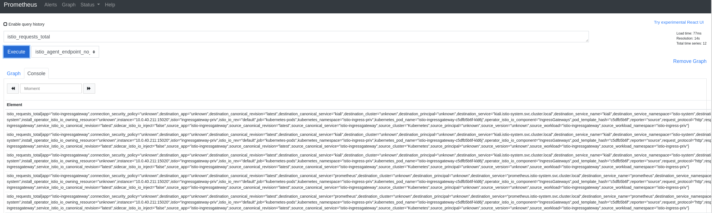
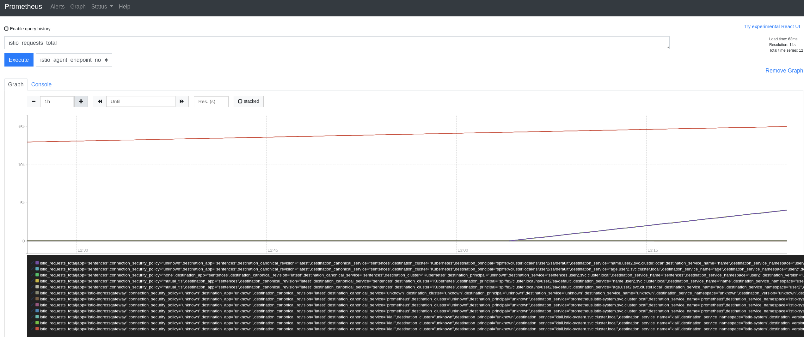

[//]: # (Copyright, Eficode )
[//]: # (Origin: https://github.com/eficode-academy/istio-katas)
[//]: # (Tags: #metrics #prometheus-annotations #sidecar-injection)

# A Tour of the Istio Metrics

## Learning goals

- Basic overview of the metrics Istio provides
- Enabling Prometheus scraping of Istio and application metrics

## Introduction

This exercise will demonstrate how to use metrics from Istio together with
Prometheus. We will also see how application metrics and Istio metrics work
together.

> This exercise assumes an Istio deployment with `enablePrometheusMerge` 
> enabled.

Istio provides telemetry for all service communication within the mesh. 
This telemetry provides **observability** of service behavior such as 
overall traffic volume, error rates in traffic and response times. 
All without any additional effort needed by the developer of a service. 

One of the types of telemetry Istio generates is metrics. This is done 
for **all** service traffic in the mesh. Both inbound and outbound. 

Istio provides three levels of metrics. 

- Proxy-level: Standard metrics about all pass-through traffic along with 
detailed statistics about the administrative functions of the proxy itself.

- Service-level: Service oriented metrics for monitoring the service 
communication.

- Control-plane: A collection of self monitoring metrics.

See the [documentation](https://istio.io/latest/docs/concepts/observability/#metrics) 
for more details.

## Exercise

First you will deploy the sentences service without sidecars and inspect 
the metrics provided by application. Afterwards you will inject sidecars 
and inspect the Istio metrics. Then you will enable a single scrape endpoint 
for both the Istio and application metrics. Finally you view and query Istio 
metrics in Prometheus.

### Overview

- Deploy the sentences application services

- Run the script `scripts/loop-query.sh`

- Inspect available metrics on a sentences service POD on port `8000/metrics`

- Inject Istio sidecar to sentences services

- Merge Istio and application metrics to one scrape endpoint

> Istio supports merging Prometheus metrics from the application and the sidecar
> into a single scrape endpoint, however this has been disabled with the
> annotation `prometheus.istio.io/merge-metrics`

- Fetch Istio Metrics

- Browse Istio Metrics in Prometheus

### Step by Step
<details>
    <summary> More Details </summary>

- **Deploy the sentences application services**

```console
kubectl apply -f 007-istio-metrics-tour/start/sentences.yaml
```

Execute `kubectl get pods` and observe that we have one container per POD.

```
NAME                         READY   STATUS    RESTARTS   AGE
age-657d4d9678-q8h7d         1/1     Running   0          3s
name-86969f7468-4qfmp        1/1     Running   0          3s
sentences-779767c659-mlcm9   1/1     Running   0          4s
```

- **Run the script `scripts/loop-query.sh`**

Execute `scripts/loop-query.sh` to see the application is running. This will also
update both Istio and sentences application metrics.

```console
./scripts/loop-query.sh
```

- **Inspect available metrics on a sentences service POD port `8000/metrics`**

To retrieve metrics from a POD in the sentences application we can query 
the metrics port 8000. 

Execute kubectl to get pods and find a node ip.


```console
kubectl get pods -o wide
```

This should produce output that looks like the following.

```console
NAME                         READY   STATUS    RESTARTS   AGE   IP            NODE                                        NOMINATED NODE   READINESS GATES
age-7584598b58-zv4wb         1/1     Running   0          14m   10.0.52.63    ip-10-0-57-188.eu-west-1.compute.internal   <none>           <none>
name-7cbf469c96-l2x42        1/1     Running   0          14m   10.0.42.100   ip-10-0-32-58.eu-west-1.compute.internal    <none>           <none>
sentences-5576c79877-vpgmq   1/1     Running   0          14m   10.0.44.91    ip-10-0-32-58.eu-west-1.compute.internal    <none>           <none>
```

Run curl with `IP` of one of the nodes on port `8000` for `/metrics` and grep 
the output for `sentence_requests_total`. E.g from the above example this 
would be `curl -s 10.0.44.91:8000/metrics | grep sentence_requests_total`

```console
curl -s <Any node IP>:8000/metrics | grep sentence_requests_total
```

This will return something like the following.

```
# HELP sentence_requests_total Number of requests
# TYPE sentence_requests_total counter
sentence_requests_total{type="name"} 584.0
```

This shows that the `name` POD had received `584` requests from the `loop-query.sh`
script when we fetched metrics.

- **Inject Istio sidecar to sentences services**

The deployed version of the sentences application have Istio sidecar injection 
**disabled**. This is done through annotations.

You can investigate the yaml file `007-istio-metrics-tour/start/sentences.yaml` 
and observe the use of the `sidecar.istio.io/inject` annotation:

```yaml
      annotations:
        sidecar.istio.io/inject: 'false'    # Sidecar injection is disabled
        prometheus.io/scrape: 'true'
        prometheus.io/port: '8000'
        prometheus.io/path: '/metrics'
```

Also note the Prometheus annotations that informs Prometheus, that this POD can
be scraped for metrics on port `8000` and path `/metrics` - similar to what we
just did manually.

Re-deploy the sentences application without the annotation that disables 
sidecar injection.

```console
cat 007-istio-metrics-tour/start/sentences.yaml |grep -v inject | kubectl apply -f -
```

If we run `kubectl get pods` now, we will see that we have two containers per
POD. 

> :bulb: It may take a few seconds for the old PODs to terminate.

Next, observe the values of the Prometheus annotations:

```console
kubectl describe pod -l mode=sentence | head -n 30
```

The result should look like this:

```
Annotations:  prometheus.io/path: /metrics
              prometheus.io/port: 8000
              prometheus.io/scrape: true
              prometheus.istio.io/merge-metrics: false
```

So there is no change in how Prometheus will scrape POD metrics. It will still
use port `8000` which is handled by the sentences application container.

- **Merge Istio and application metrics to one scrape point**

What about the Istio metrics from the sidecar?

Istio supports merging Prometheus metrics from the application and the sidecar
into a single scrape endpoint, however this has been disabled with the
annotation `prometheus.istio.io/merge-metrics`.

Re-deploy the sentences application with this annotation removed as well.

```console
cat 007-istio-metrics-tour/start/sentences.yaml |egrep -v 'inject|merge-metrics' | kubectl apply -f -
```

> :bulb: It may take a few seconds for the old PODs to terminate.

If we now inspect the POD annotations as above, we see the metrics scrape 
endpoint has moved from the application to the sidecar.

```
Annotations:  prometheus.io/path: /stats/prometheus
              prometheus.io/port: 15020
              prometheus.io/scrape: true
```

- **Fetch Istio Metrics**

Now that we have a single merged scrape endpoint for the application metrics 
and the Istio metrics we can fetch them both. 

First, list PODs to get their cluster IP as it has changed when we changed the 
prometheus annotation.

```console
kubectl get pods -o wide
```

Then run the curl command as before but use the new **merged** scrape endpoint.

```console
curl -s <POD IP>:15020/stats/prometheus | grep requests_total
```

The result of which should look somewhat like the following for e.g. 
the `name` service. 

```
istio_requests_total{response_code="200",
                     source_workload="sentences",
                     source_version="unknown",
                     destination_workload="name",
                     destination_version="unknown"}   265
sentence_requests_total{type="name"}                  265
```

> Note the output above is edited for clarity.

Note, that we both see a `sentence_requests_total` metric and an
`istio_requests_total` metric - the former generated by the sentences 
application and the other by the Istio sidecar. They should show the same 
numeric value, however, since the Istio metric contains additional labels, 
e.g. source and destination of requests there could be differences
with the request count spread out on differently labelled `istio_requests_total`
metrics.

> The labels `source_workload`, `destination_workload`, `source_version` etc. is
> the primary information Kiali use to dynamically build application graphs and
> versioned graphs. See this link for more information on how [Kiali use
> Prometheus metrics](https://kiali.io/documentation/latest/faq/#prom-metrics)

- **Browse Istio Metrics in Prometheus**

Istio makes the base monitoring data available but you still need something 
to analyze and put the data to use. 
[Prometheus](https://istio.io/latest/docs/ops/integrations/prometheus/) is 
an open source monitoring system and time series database. You can use 
Prometheus with Istio to record metrics that track the health of Istio and 
of applications within the service mesh. 

Browse to prometheus. The instructor should have given you the URL.

Select the **graph** menu item on the top and enter `istio_requests_total` in 
**Expression** box and hit execute. 

You should see Istio metrics being returned as shown in the below image.



You can select the **graph** tab to see a graphical representation as shown 
below.



The above results are for **all** traffic in the mesh, e.g. including traffic 
going through the ingress gateway. 

If you want narrow the results down to the traffic between the sentences 
services you could replace the expression with 
`istio_requests_total{app="sentences"}`. This would give results for **all** 
the services labelled with `app=sentences` across all namespaces.

If you wanted the results for a specific service, say the `age` service, in a 
specific namespace you could change the expression to use `destination_service` 
and specify the full name with `<NAMESPACE>.svc.cluster.local`. 

For example to get istio requests total for the `age` service in the `user2` 
namespace you could specify the expression 
`istio_requests_total{destination_service="age.user2.svc.cluster.local"}`

Although not part of our course setup you can also visualize metrics using 
[Grafana](https://istio.io/latest/docs/ops/integrations/grafana/) to create 
Dashboards.

</details>

## Summary

In this exercise you have inspected some of the metrics Istio provides along 
with how to enable for Prometheus.

Important takeaways are the following. 

- Istio metrics begin with the sidecar. **Each** proxy generates metrics for 
**all** traffic passing through the sidecar proxy. Both inbound and outbound.

- By **default** Istio enables only a small subset of envoy generated 
statistics to avoid overwhelming the metrics backend.

- Istio provides three sets of metrics. Proxy-level metrics, service-level 
metrics and control plane metrics.

- Istio has the ability to control scraping **entirely** by prometheus 
annotations and this method is enabled by default. When enabled, appropriate 
prometheus annotations will be added to all data plane pods. 

For an overview of the standard Istio **service-level** metrics see this 
[documentation](https://istio.io/latest/docs/reference/config/metrics/).

## Cleanup

```console
kubectl delete -f 007-istio-metrics-tour/start/sentences.yaml
```
