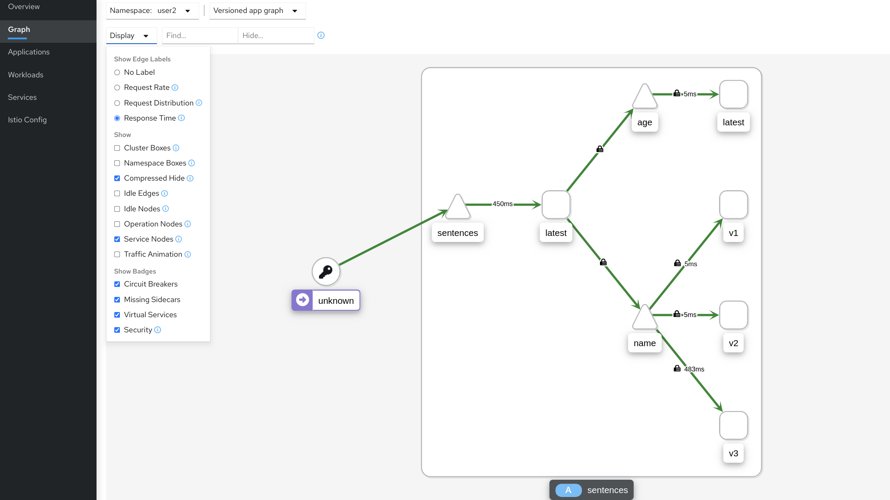

[//]: # (Copyright, Eficode )
[//]: # (Origin: https://github.com/eficode-academy/istio-katas)
[//]: # (Tags: #delay #network-delay #kiali)

# Observing Network Delays

## Learning goal

- Introduction to Jaeger and distributed tracing

## Introduction

In this exercise will introduce some network delays to the sentences application. 
Some forms of delays can be observed with the **metrics** that Istio tracks. 

> Metrics are statistical and not specific to a certain request, i.e. we can 
> only observe statistical data about observations like sums and averages. 

This is quite useful but a quite limited in a true service based architecture. 
Therefor we will introduce a *slightly* more complex delay. If the delay was 
caused by something more complicated it would be difficult to diagnose purely 
from metrics due to their statistical nature.

Besides metrics, Istio generates another type of telemetry, 
[distributed trace](https://istio.io/latest/docs/concepts/observability/#distributed-traces) 
**spans**, which can help solve these more complex scenarios. This allows 
for a detailed understanding of call flows and service dependencies within 
a mesh. 

Istio supports distributed tracing through the envoy proxy sidecar. The proxies 
**automatically** generate trace **spans** on **behalf** applications they proxy. 

The sidecar proxy will send the tracing information directly to the tracing 
backends. So the application developer does **not** know or worry about a 
distributed tracing backend. 

Istio, **does** rely on the application to propagate some headers for subsequent 
outgoing requests so it can stitch together a complete view of the traffic. 
Specifically the [B3 trace headers](https://github.com/openzipkin/b3-propagation). 
See more **More Istio Distributed Tracing** below for a list of the required headers.

<details>
    <summary> More Istio Distributed Tracing </summary>

The “span” is the primary building block of a distributed trace, representing 
an individual unit of work done in a distributed system. Each component of the 
distributed system contributes a span - a named, timed operation representing 
a piece of the workflow.

Spans can (and generally do) contain “References” to other spans, which allows 
multiple Spans to be assembled into one complete Trace - a visualization of the 
life of a request as it moves through a distributed system.

Istio supports a number of tracing backends but we will be using 
[Jaeger](https://istio.io/latest/docs/tasks/observability/distributed-tracing/jaeger/) 
as the backend for this exercise.

Istio Requires the following B3 tracing headers to be propagated across the services.

- x-request-id
- x-b3-traceid
- x-b3-spanid
- x-b3-parentspanid
- x-b3-sampled
- x-b3-flags
- b3

</details>

## Exercise

First we are going to deploy the sentences application with three versions of 
the name service. One of these has introduced a delay which we can fairly 
easily find with the standard Istio metrics. 

Then we are going to deploy a three tiered setup for the sentences application, 
introduce a version with a simulated bug that causes large delays on the 
combined service and see how Jaeger can help find the delay using spans 
provided by the envoy sidecar.

- The misbehaving service might be owned by another team

- The misbehaving application might not be the immediate one from which you are
  observing a delay. In fact, it might be deep in the application tree

### Overview

- Deploy sentences application with 3 versions of the `name` service

- Run the script `scripts/loop-query.sh`

- Observe the traffic flow with Kiali

- Deploy a three tiered version of the sentences application

- Run the script `scripts/loop-query.sh`

- Observe the traffic flow with Kiali

- Deploy version two of the sentences service

> :bulb: This version introduces a simulated bug which will cause delays 
> for the combined service.

- Observe the traffic flow with Kiali

- 

### Step by Step
<details>
    <summary> More Details </summary>

- **Deploy sentences application with 3 versions of the `name` service**

```console
kubectl apply -f 008-observe-network-delays/start/
kubectl apply -f 008-observe-network-delays/start/v1
kubectl apply -f 008-observe-network-delays/start/v2
kubectl apply -f 008-observe-network-delays/start/v3
```

In another shell, run the following to continuously query the sentence service
and observe the effect of deployment changes.

- **Run the script `scripts/loop-query.sh`**

```console
scripts/loop-query.sh
```

> Note that we have not created any Istio Kubernetes resources to affect
> routing, i.e. requests to the `name` services are approximately evenly
> distributed across the three version. However, from the output of
> `loop-query.sh` we will observe an occasional delay.

- **Observe the traffic flow with Kiali**

Go to Graph menu item and select the **Versioned app graph** from the drop 
down menu. 

If we open Kiali and select to display 'response time', we see the following,
which shows that `v3` have a significantly higher delay than the two other
versions.



This is a super simple scenario where Istio provided metrics and Kiali can 
give us some insights into the network delay. With a deeper tree and more 
complex debugging scenario we can use distributed tracing to help.

- **Deploy a three tiered version of the sentences application**

First delete the sentence applications services.

```console
kubectl delete -f 008-observe-network-delays/start/
kubectl delete -f 008-observe-network-delays/start/v1/
kubectl delete -f 008-observe-network-delays/start/v2/
kubectl delete -f 008-observe-network-delays/start/v3/
```

Deploy the following version of the `sentence` application - now with
three tiers to simulate a slightly more complex application:

```console
kubectl apply -f 008-observe-network-delays/start/three-tiers/
```

- Run the script `scripts/loop-query.sh`

In another shell, run the following to continuously query the sentence service
and observe the effect of deployment changes:

```console
./scripts/loop-query.sh
```

- **Observe the traffic flow with Kiali**

Go to Graph menu item and select the **Versioned app graph** from the drop 
down menu. 


Next, deploy `v2` of the `sentences` service:

```console
kubectl apply -f 008-observe-network-delays/start/three-tiers/v2/
```

This version has a (simulated) bug, that causes large delays on the combined
service as we can see from the following Kiala application graph.


Now the SRE team for the `random` service is being paged, and they might find it
difficult to understand what have changed. Remember, the `sentences` service
might be developed by another team. How can the SRE team for `random` figure out
that they need to contact the responsible for `sentences` version `v2`?

If we search for traces in Jaeger where the trace time is high and inspect the
trace, we will find that the top-level service is indeed `sentences` version
`v2`:


</details>

## Summary


## Cleanup

```console
kubectl delete -f 008-observe-network-delays/start/three-tiers/
kubectl delete -f 008-observe-network-delays/start/three-tiers/v2/
```
