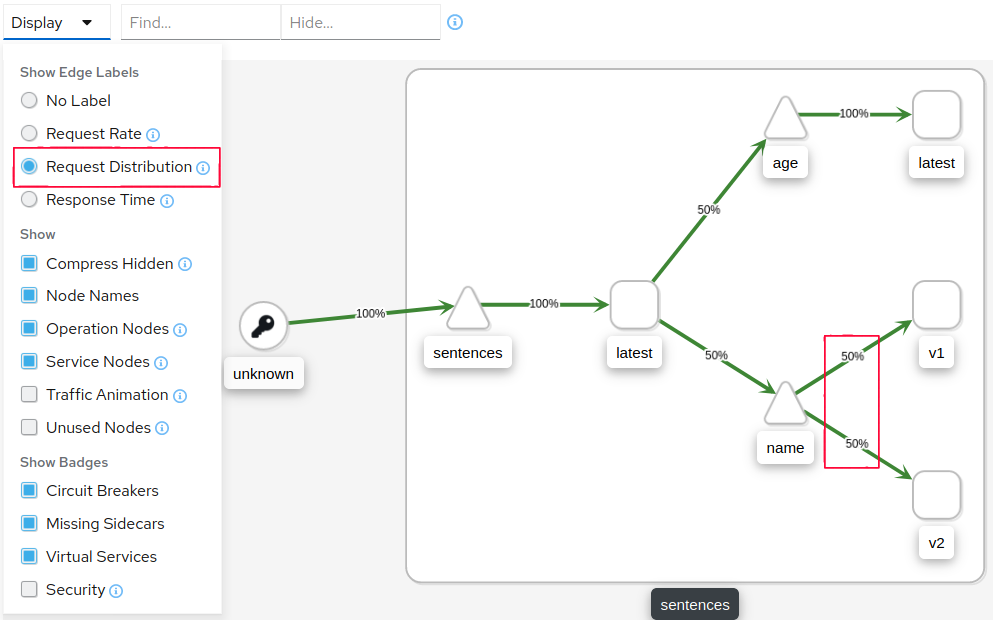
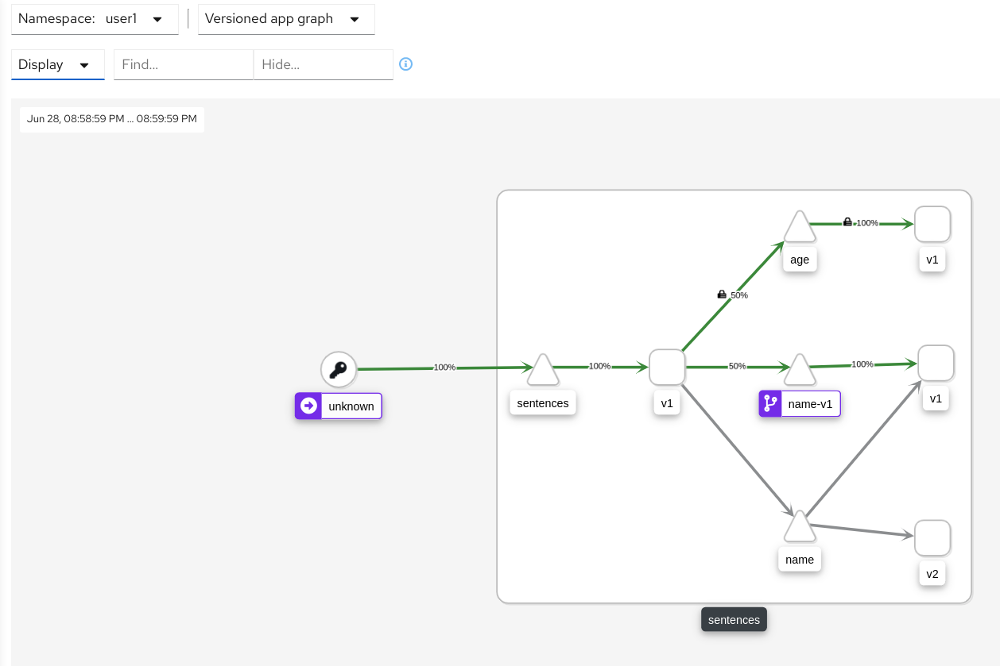
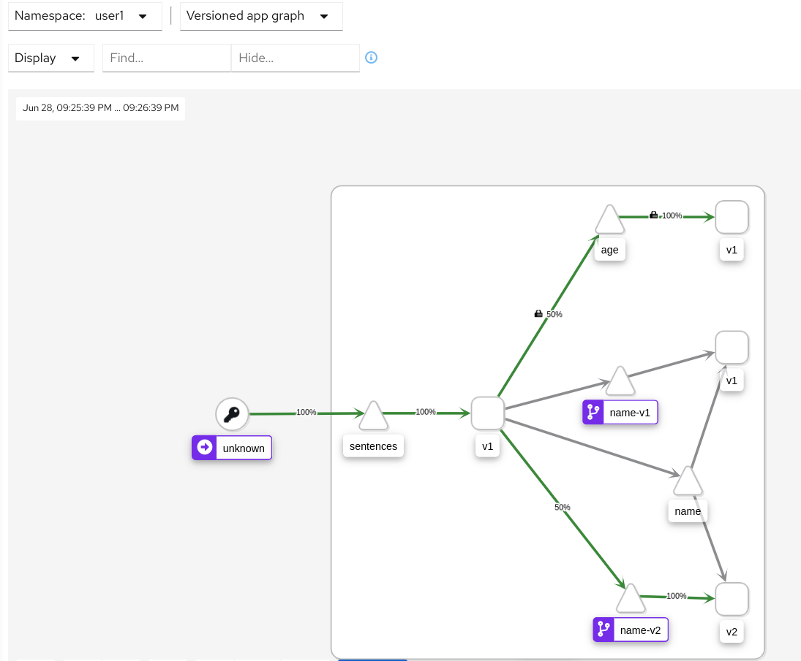

[//]: # (Copyright, Eficode )
[//]: # (Origin: https://github.com/eficode-academy/istio-katas)
[//]: # (Tags: #sentences #kiali)

# Routing Traffic with Istio

## Learning goal

- Using Virtual Services
- Using Destination Rules

## Introduction

This exercise introduces you to the basics of traffic routing with Istio. 
We are going to deploy all the services for our sentences application 
and a new version of the **name** service. This will demonstrate normal 
kubernetes load balancing bewtween services. 

Then we are going to use two Istio custom resource definitions(CRD's) which are
the building blocks of Istio's traffic routing functionality to route traffic to 
the desired workloads.

The VirtualService and the DestinationRule.

## VirtualService

A VirtualService defines a set of traffic routing rules to apply when a host 
is addressed. Each routing rule defines matching criteria for traffic of a 
specific protocol. If the traffic is matched, then it is sent to a named 
destination **service** or subset/version of it.

```console
apiVersion: networking.istio.io/v1alpha3
kind: VirtualService
metadata:
  name: my-service-route
spec:
  hosts:
  - my-service
  http:
  - route:
    - destination:
        host: my-service-v1
    - destination:
        host: my-service-v2
```
The **http** section contains the routing rules for HTTP/1.1, HTTP/2 and gRPC 
traffic. You can also use TCP and TLS sections for configuring routing.

The **hosts** field is the user addressable destination that the routing rules 
apply to. This is **virtual** and doesn't actuaslly have to exist. For examnple 
You could use it for consolidating routes to all services for an application. 

The **destination** field specifies the **actual** destination of the routing 
rule and **must** exist. In kubernetes this is a **service** and generally 
takes a form like `reviews`, `ratings`, etc.

## Exercise 1

### Overview

- Deploy the sentences app and a second version (`v2`) of the name service. 

- Run the script `scripts/loop-query.sh` to produce traffic.

- Use the version app graph in Kiali to observe the traffic flow.

- Route **all** traffic to version 1 of the name service with a Virtual Service.

> :bulb: A virtual service lets you configure how requests are routed 
> to a **service** within an Istio service mesh.

- Observe route precedence by adding a route to version 2 of the name service.

### Step by Step
<details>
    <summary> More Details </summary>

**Deploy sentences app and 2 versions of name services**

```console
kubectl apply -f deploy/basic-traffic-routing/start/
```

**Run loop-query.sh**

```console
./scripts/loop-query.sh
```

**Observe traffic flow with the **version app graph** in Kiali**


What you are seeing here is kubernetes load balancing between PODS.
Kubernetes, or more specifically the `kube-proxy`, will load balance in 
either a *round robin* or *random* pattern depending on whether it is 
running in *user space* proxy mode or *IP tables* proxy mode.

You rarely want traffic routed to two version in an uncontrolled 
fashion.

So why is this happening?

> :bulb: Take a look at the label selector for the name service.
> It doesn't specify a version...

**Route ALL traffic to version 1 of the name service** 

Create a new service called `name-svc-v1.yaml` which has a version (`v1`) in 
the label selector in `deploy/basic-traffic-routing/start/` and apply it.

```yaml
apiVersion: v1
kind: Service
metadata:
  labels:
    app: sentences
    mode: name
    version: v1
  name: name-v1
spec:
  ports:
  - port: 5000
    protocol: TCP
    targetPort: 5000
  selector:
    app: sentences
    mode: name
    version: v1
  type: ClusterIP
```

```console
kubectl apply -f deploy/basic-traffic-routing/start/name-svc-v1.yaml
```

Create a virtual service called `name-virtual-service.yaml` in 
`deploy/basic-traffic-routing/start/` and apply it.

```yaml
apiVersion: networking.istio.io/v1alpha3
kind: VirtualService
metadata:
  name: name-route
spec:
  hosts:
  - name
  http:
  - route:
    - destination:
        host: name-v1
```

```console
kubectl apply -f deploy/basic-traffic-routing/start/name-virtual-service.yaml
```

Observe the traffic flow in Kiali using the **versioned app graph**. It may 
take a minute before fully complete but you should see the traffic being routed 
to the `name-v1` **service**.

> :bulb: Make sure to select `Idle Edges` and `Service Nodes` in the Display 
drop down.



**Observe route precedence**

Create a new service called `name-svc-v2.yaml` which has a version (`v2`) in 
the label selector in `deploy/basic-traffic-routing/start/` and apply it.

```yaml
apiVersion: v1
kind: Service
metadata:
  labels:
    app: sentences
    mode: name
    version: v2
  name: name-v2
spec:
  ports:
  - port: 5000
    protocol: TCP
    targetPort: 5000
  selector:
    app: sentences
    mode: name
    version: v2
  type: ClusterIP
```

```console
kubectl apply -f deploy/basic-traffic-routing/start/name-svc-v2.yaml
```

Add a destination to the new service in the `name-virtual-service.yaml` you 
created before. But place it **before** the `name-v1` service and apply it.

```yaml
apiVersion: networking.istio.io/v1alpha3
kind: VirtualService
metadata:
  name: name-route
spec:
  hosts:
  - name
  http:
  - route:
    - destination:
        host: name-v2
  - route:
    - destination:
        host: name-v1
```

Observe the traffic flow in Kiali using the **versioned app graph**.
You will see that trafiic is now being routed to the version 2 service.



Routing rules are evaluated in sequential order from top to bottom, with the 
first rule in the virtual service definition being given highest priority. 

Reorder the destination rules so that service `name-v1` will be evaluated 
first and apply the changes.

```console
kubectl apply -f deploy/basic-traffic-routing/start/name-virtual-service.yaml
```

Traffic should now be routed to the `name-v1` service.

## DestinationRule

You can think of virtual services as how you route your traffic to a given 
destination, and then you use destination rules to configure **what** happens 
to traffic for that destination.

The most common use of `DestinationRule` is to specify named service **subsets**.

For example, grouping all of a service instances **versions**. You can then 
use these **subsets** in a virtual service to control traffic to different versions.

### DestinationRule

You can think of virtual services as how you route your traffic to a given 
destination, and then you use destination rules to configure **what** happens 
to traffic for that destination.

The most common use of `DestinationRule` is to specify named service **subsets**.

For example, grouping all of a services instances versions. You can then use these 
**subset** in a virtual service to control to different instances.

```yaml
apiVersion: networking.istio.io/v1alpha3
kind: DestinationRule
metadata:
  name: my-destination-rule
spec:
  host: my-service
  subsets:
  - name: v1
    labels:
      version: v1
  - name: v2
    labels:
      version: v2
  - name: v3
    labels:
      version: v3
```

> :bulb: Destination rules are applied **after** virtual service routing rules are evaluated, so they apply 
> to the traffic’s “real” destination.

## Exercise 2

- 

- 

- 
 

### Step by Step
<details>
    <summary> More Details </summary>

**Bold from bullets**

```console
a command
```

**Bold from bullets**

```console
a command
```
</details>

Some summary text!

# Cleanup

```console
kubectl delete -f deploy/v1
```
