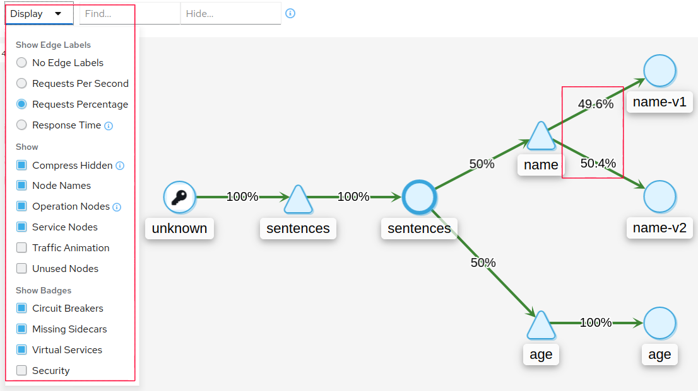
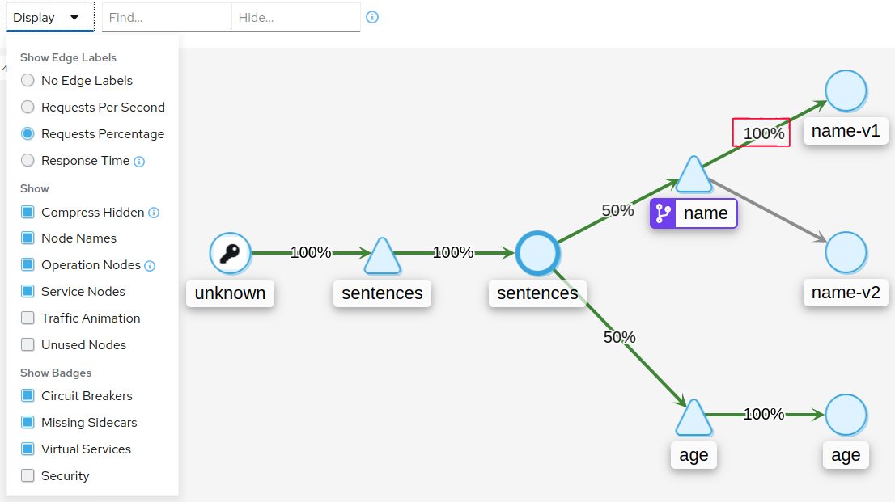
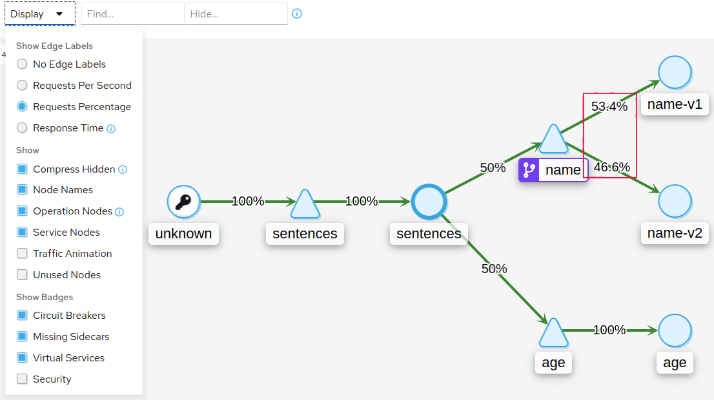

# Blue/green deployments with Kubernetes Labels

Exercise [Blue/green deployments](blue-green-deployment.md) showed how to
implement alternative service routing using Kubernetes service to define
different version. In Kubernetes labels are often used to define different
versions. In this exercise we will show how to use do routing with Istio and
Kubernetes labels.

First, deploy version `v1` and `v2`:

```sh
kubectl apply -f deploy/v1
kubectl apply -f deploy/v2
```

In another shell, run the following to continously query the sentence service
and observe the effect of deployment changes:

```sh
scripts/loop-query.sh
```

Next, open Kiali and inspect the service topology as shown below. Note the
**display settings** in the left side - adjust your settings to match those
shown. Also, note that the traffic routed to `name-v1` and `name-v2` are
approximately equally distributed. 



The load balancing we are seeing are ordinary Kubernetes service load balancing.

Next, we create an Istio
[VirtualService](https://istio.io/latest/docs/reference/config/networking/virtual-service/)
that:

- Identify different versions based on Kubernetes labels using a [Destination
  Rule](https://istio.io/latest/docs/reference/config/networking/destination-rule).

- Route traffic to different versions based on the value of the HTTP header `x-test` (similarly to the [Blue/green deployments](blue-green-deployment.md) exercise).

Create an Istio `VirtualService` and `DestinationRule`:

```sh
kubectl apply -f deploy/virtual-service-label-based.yaml
```

If we observe the result in Kiali, we see that all our traffic is now routed to
`name-v1` because the `query-loop.sh` command we are using us not adding an
`x-test` header. We also see, that Kiali indicates that routing is being
affected by a `VirtualService`:



In another shell, run the following to continously query the sentence service
version `name-v2`:

```sh
scripts/loop-query.sh 'x-test: use-v2'
```

With this we now observe in Kiali, that traffic is equally distributed between
the two versions:




# Cleanup

```sh
kubectl delete -f deploy/v1
kubectl delete -f deploy/v2
kubectl delete -f deploy/virtual-service-label-based.yaml
```