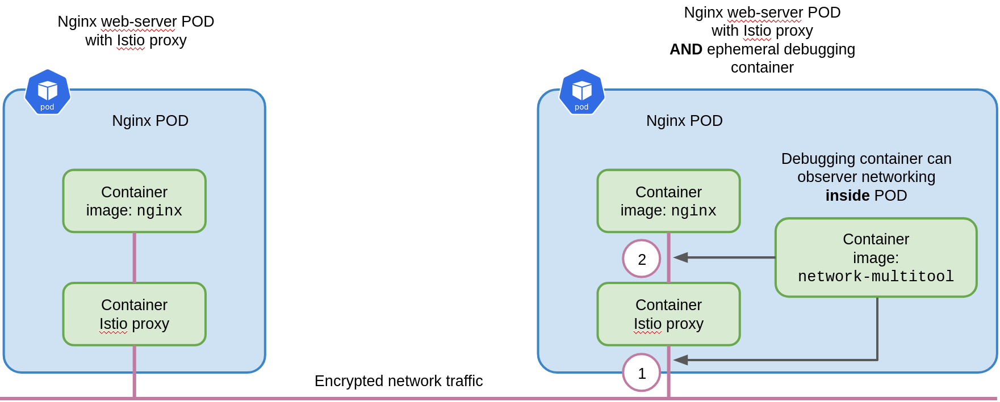

[//]: # (Copyright, Michael Vittrup Larsen)
[//]: # (Origin: https://github.com/MichaelVL/istio-katas)
[//]: # (Tags: #epehemeral-containers)

# Debugging with Ephemeral Containers

With Istio, all traffic is by default encrypted, which makes debugging network
issues difficult since we cannot simply inspect the network traffic using tools
like `tcpdump`. 

This exercise will demonstrate how to debug network traffic using Kubernetes
[Ephemeral
containers](https://kubernetes.io/docs/concepts/workloads/pods/ephemeral-containers/).

> Ephemeral containers have been available in Kubernetes since 1.16, however,
> they are not enabled by default on many production Kubernetes deployments. The
> following assumes a Kubernetes cluster deployed with feature gate
> `EphemeralContainers=true`.

First, we create a web server deployment and expose it with a service:

```console
kubectl create deploy nginx --image nginx
kubectl expose deploy nginx --port 80
```

Next, we create a tooling deployment from which we can query the web
server. Alternatively you may create the service above with type `LoadBalancer`
or `NodePort` and access the web server through those service types.

```console
kubectl create deploy multitool --image praqma/network-multitool
```

Exec into the tooling POD as follows:

```console
kubectl exec -it <multitool POD> -- bash
```

and query the web server with a `curl` command. You should expect to see the
*Welcome to nginx!* HTML output from the curl command.

```console
curl nginx
```

To observe traffic un-encrypted, we attach an *ephemeral container* to the
running web server POD using the `kubectl debug` command. Note that this does
not restart the web server POD, but instead it attaches an additional container
to the POD. With this additional container, we can inspect volumes, and perform
network operations similar to the other containers in the POD.

The following figure illustrate an 'ordinary' web server POD with just the Istio
proxy (left) and a POD with an ephemeral container attached using the container
image `praqma/network-multitool`:



Attach an ephemeral container to our web server POD with the following command
and run bash inside this container (note how this is very similar to an `exec`
into an existing container):

```console
kubectl debug -it <nginx POD> --image praqma/network-multitool -- bash
```

If we run the following command in another terminal to inspect the nginx POD, we
will see that an ephemeral container has been attached:

```console
kubectl get po <nginx POD> -o jsonpath='{.spec.ephemeralContainers}' | jq .
```

```yaml
  {
    "command": [
      "bash"
    ],
    "image": "praqma/network-multitool",
    "imagePullPolicy": "Always",
    "name": "debugger-7hcwx",
    "stdin": true,
    "tty": true
    ...
  }
  ...
```

With the bash terminal inside the debugging container, we can list the network interfaces:

```console
ip link list
```

Also, we can inspect network traffic with `tcpdump`, e.g. use the following
command to inspect network traffic at the POD *external interface* (marked with
(1) on the figure above):

```console
tcpdump -i eth0 -vv -XX 'tcp port 80'
```

With the command above, and re-running the `curl` command from the tooling
container you will see an encrypted response from the Nginx web server.

To inspect traffic between the Istio proxy and the web server container (marked
with (2) on the figure above), inspect traffic internally in the POD using the
`lo` interface (i.e. *local* interface):

```console
tcpdump -i lo -vv -XX 'tcp port 80'
```

With the command above you should see un-encrypted traffic, i.e. using ephemeral
containers is a very useful Istio debugging technique.

See also the exercise [When not to use TLS](when-not-to-use-tls.md).

## Removing the Ephemeral Container

It is currently not possible to remove an ephemeral container. Deleting the POD is the only way to remove it.

It makes good sense to consider a POD which have had ephemeral containers
injected to be *tainted* in the sense that they should not be restored to normal
operation since operations with the ephemeral container could have modified the
original POD.

The same applies to PODs/containers which someone have exec'ed into - they
should be considered *tainted* and eventually deleted.

# Cleanup

```console
kubectl delete svc nginx
kubectl delete deploy nginx
kubectl delete deploy multitool
```