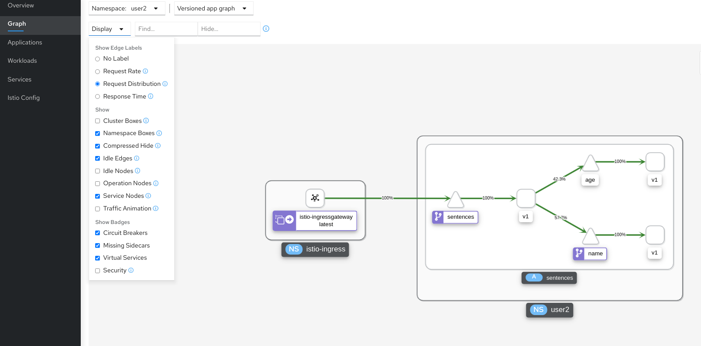
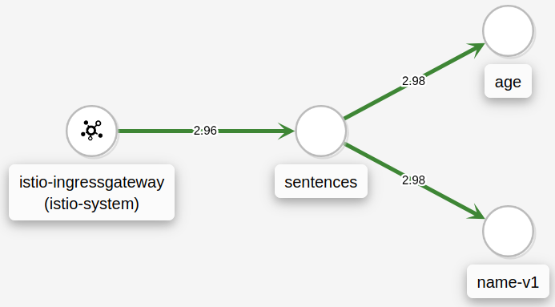

# Getting Traffic into the Mesh with Ingress Gateways

The previous exercises used a Kubernetes node-port service to get traffic to the
sentences application. This approach means that external requests enters the
Kubernetes cluster network and are directly forwarded to the frontend `sentence`
service. From the frontend service to the `age` and `name` services traffic is
flowing inside the Istio mesh network.

Ingressing traffic directly from the Kubernetes cluster network to a frontend
service means that Istio features cannot be applied on this part of the traffic
flow. Istio provides dedicated Ingress gateways that provide a controlled
entry-point to the service mesh. An ingress gateway is one or more PODs with the
Envoy proxy inside, which has an Kubernetes-native service on the 'input' side
and is connected to the mesh on the 'backside'.

Ingress gateways typically are deployed in the `istio-system` namespace (but is
not limited to this), and we can find them with the following command:

```console
kubectl -n istio-system get deploy --show-labels
```

In the infrastructure used to develop these exercises we have two ingress
gateway deployments:

```console
NAME                       READY   UP-TO-DATE   AVAILABLE   AGE   LABELS
istio-ingressgateway       1/1     1            1           24m   app=istio-ingressgateway,istio=ingressgateway ...
istio-ingressgateway-int   1/1     1            1           24m   app=istio-ingressgateway-int,istio=ingressgateway-int ...
```

The usecase for two ingress gateways are [described here](https://github.com/MichaelVL/contour-envoy-helm-chart).

These gateways are merely dataplanes for traffic, and cannot do anything without
further configuration. They are very similar to traditional Kubernetes ingress
controllers without Ingress resources defined.

Before configuring a gateway, we deploy the sentences application:

```console
kubectl apply -f deploy/v1
```

To configure ingress through a gateway we need to define two resources:

- Gateway: Defines a gateway 'entry'. This consists of a port number (e.g. `80`), a protocol (e.g. `HTTP`) and a hostname (e.g. `sentences.example.com`).

- VirtualService: Defines routes for the gateway. A `Gateway` definition only defines the 'entry' but no traffic can be routed by the gateway without a VirtualService.

The [Gateway](https://istio.io/latest/docs/reference/config/networking/gateway/) definition found in `deploy/mesh-in/gateway.yaml` looks like this:

```yaml
apiVersion: networking.istio.io/v1beta1
kind: Gateway
metadata:
  name: sentences
spec:
  selector:
    app: istio-ingressgateway
    istio: ingressgateway
  servers:
  - port:
      number: 80
      name: http
      protocol: HTTP
    hosts:
    - "sentences.example.com"
```

here, the selectors are the labels we saw earlier on the ingress gateway PODs,
i.e. this Gateway definition applies to the PODs of the `istio-ingressgateway`
deployment.

We also see, that the gateway is for HTTP on port 80 and for the host `sentences.example.com`.

Apply this definition:

```console
kubectl apply -f deploy/mesh-in/gateway.yaml
```

To route traffic from the gateway to the sentence application, we use the following [VirtualService](https://istio.io/latest/docs/reference/config/networking/virtual-service/):

```yaml
apiVersion: networking.istio.io/v1beta1
kind: VirtualService
metadata:
  name: sentences
spec:
  hosts:
  - "sentences.example.com"
  gateways:
  - sentences
  http:
  - route:
    - destination:
        host: sentences
```

Note how it specifies the hostname and the name of the gateway (in
`spec.gateways`), i.e. a Gateway definition can define an entry for many
hostnames and a VirtualService can be bound to multiple gateways, i.e. these are
not necessarily related one-to-one.

We also see, that the VirtualService routes all traffic for the given hostname
to the `sentences` service (the two last lines specifying the Kubernetes
`sentences` service as destination).

Apply the routing:

```console
kubectl apply -f deploy/mesh-in/virtual-service.yaml
```

Next, start the following script to continuously query the sentences service
through the ingress gateway.

> Note that this scripts assumes your Istio ingress gateway are exposed with a LoadBalancer service and labelled with `app=istio-ingressgateway`. If this is not the case, you might want to adjust the script.

```console
scripts/loop-query-loadbalancer-ep.sh
```

With queries running against the sentences application, we can see them flowing
through the ingress gateway in Kiali ('service graph'):



## A Note on 'Unknown' Traffic

In the view above from Kiali above, we see TCP traffic originating from an 'unknown' source. Such traffic is typically caused by:

- Traffic originating from PODs outside the mesh, i.e. without an Istio sidecar.
- Traffic that Istio is not or cannot detect to be HTTP/HTTPS.

In the latter situation, we can specify the application protocol for each of our ports in our Kubernetes service using the [appProtocol field](https://kubernetes.io/docs/reference/generated/kubernetes-api/v1.20/#serviceport-v1-core). See also [Istio protocol selection](https://istio.io/latest/docs/ops/configuration/traffic-management/protocol-selection).

For the sentences service, we could modify `deploy/v1/sentences.yaml` by adding
`appProtocol: http` as shown in the excerpt below.

```yaml
spec:
  ports:
  - port: 5000
    protocol: TCP
    targetPort: 5000
    appProtocol: http
```

Add `appProtocol` to the service definition in `deploy/v1/sentences.yaml` and
re-apply the file, or alternatively edit the Kubernetes service directly:

```console
KUBE_EDITOR=nano kubectl edit svc sentences
```

With this change, we see the following in Kiali:



In exercise [Securing with Mutual TLS](mutual-tls.md) we will extend what we
have seen in this exercise to mutual-TLS, i.e. authenticating both client and
server in the TLS connection.

## Cleanup

```console
kubectl delete -f deploy/mesh-in/virtual-service.yaml
kubectl delete -f deploy/mesh-in/gateway.yaml
kubectl delete -f deploy/v1
```