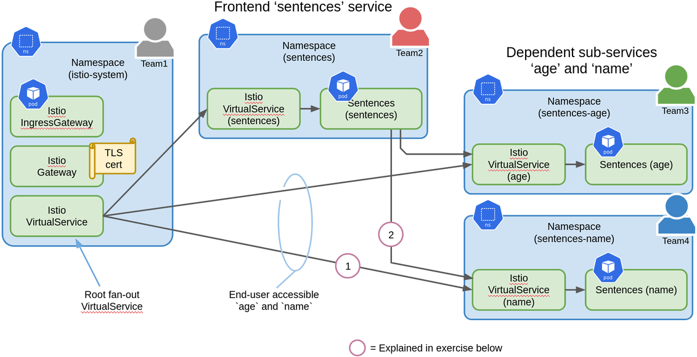
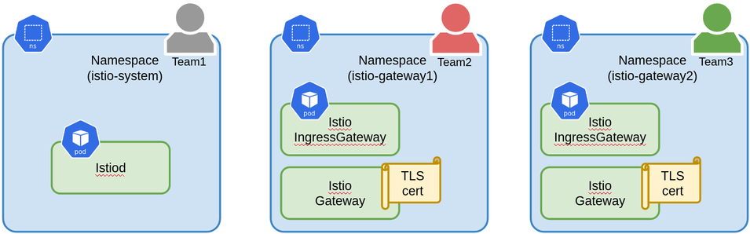
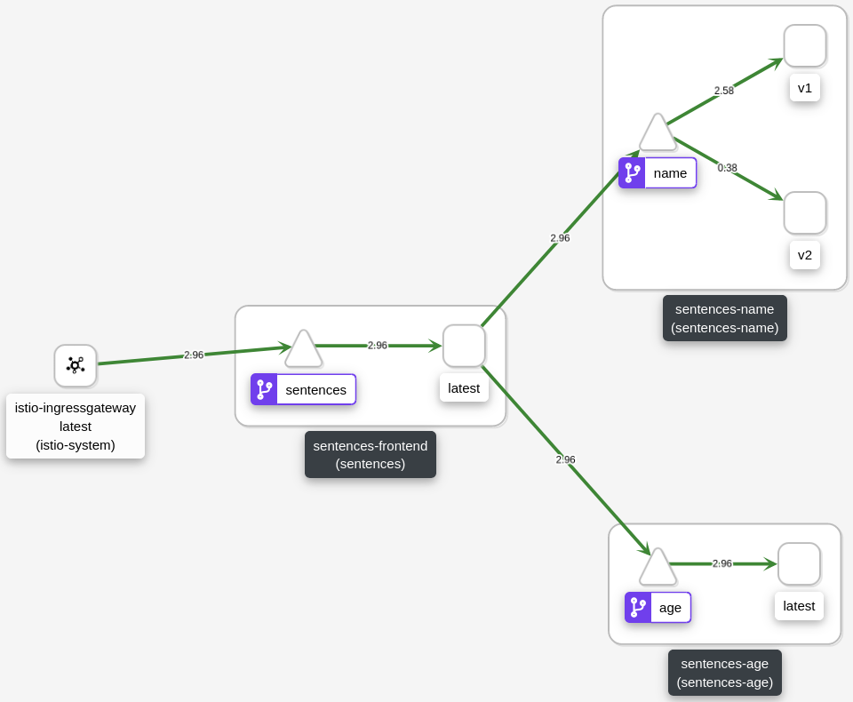

# Multiple Teams and Separation of Duties

> This exercise require an Istio deployment with VirtualService delegation support. This is not enabled by default in Istio versions prior to 1.8.0.

> This exercise builds on [Getting Traffic into the Mesh with Ingress Gateways](getting-traffic-into-mesh.md).

The sentences application is rather simple, but real-world applications could
very well require multiple teams to fit within a *two pizzas sized DevOps
team*. In such a case we would like each team to have full autonomy
wrt. development and operations related to each of the tree services. In fact,
we might like to divide management of the sentences application between the
following teams:

1. A team which manages the entry-point of traffic into Kubernetes. E.g. this
team will manage the ingress gateway deployment and scaling with a Kubernetes
HorizontalPodAutoscaler configuration. They may also manage infrastructure
outside Kubernetes, e.g. a load-balancer in front of the ingress gateway PODs
and TLS certificate management through a trusted certificate authority. TLS
certificates can be associated with the ingress gateways to allow the gateway to
terminate TLS. Part of the entry-point configuration will be definition of Istio
Gateway and a root VirtualService that fan-out traffic to the tree sentences
services.

2. Three teams, one for each of the `age`, `name` and `sentences` service. These
teams will be allocated their own Kubernetes namespace in which they have a
considerable amount of authority (possibly with some quota limitations set by
the SRE team). In their own namespace, these teams will be doing [Blue/green
Deployments](blue-green-deployment.md) or [Canary
Deployments](canary-deployment.md) by managing VirtualServices defined in their
own namespace.

While this exercise use Istio to implement this approach, a similar approach
using the [Contour ingress controller](https://projectcontour.io/) is described
in the blog-post : [Kubernetes 1.19: The future of traffic ingress and
routing](https://www.cncf.io/blog/2020/10/29/kubernetes-1-19-the-future-of-traffic-ingress-and-routing)

The teams, namespaces, Gateway and VirtualServices are illustrated below. Note,
that in the sentences application, the services `age` and `name` are not
directly accessed by end-users. In this exercise we will allow these services to
be accessed by end-users, and this is the reason why the fan-out VirtualService
in the `istio-system` namespace redirects traffic to the VirtualService in the
`sentence-age` and `sentence-name` namespaces.



## Setup Namespaces

For this exercise we will setup the following three namespaces and store their
names in environment variables. Use the following command to setup namespaces as
shown above or modify the commands to use alternative names:

```sh
source deploy/teams/namespaces.sh
```

Alternatively, modify the following for alternative namespace names. Note that
its important, that `SENTENCES_INGRESSGATEWAY_NS` is the namespace in which the
ingress gateways are deployed:

```sh
export SENTENCES_INGRESSGATEWAY_NS=istio-system
export SENTENCES_NS=sentences
export SENTENCES_AGE_NS=sentences-age
export SENTENCES_NAME_NS=sentences-name

kubectl create ns $SENTENCES_NS      || true
kubectl create ns $SENTENCES_AGE_NS  || true
kubectl create ns $SENTENCES_NAME_NS || true

kubectl label ns $SENTENCES_NS     istio-injection=enabled
kubectl label ns SENTENCES_AGE_NS  istio-injection=enabled
kubectl label ns $SENTENCES_NAME_NS istio-injection=enabled
```

## Create Certificate Authority and Certificate

For this exercise we will create our own Certificate Authority and use it to
create a certificate for `sentences.example.com`.

Create the certificate authority:

```sh
openssl req -x509 -sha256 -nodes -days 365 -newkey rsa:2048 -subj '/O=example Inc./CN=example.com' -keyout example.com.key -out example.com.crt
```

Create a certificate signing request and use our certificate authority to sign it:

```sh
openssl req -out sentences.example.com.csr -newkey rsa:2048 -nodes -keyout sentences.example.com.key -subj "/CN=sentences.example.com/O=ACMEorg"
openssl x509 -req -days 365 -CA example.com.crt -CAkey example.com.key -set_serial 0 -in sentences.example.com.csr -out sentences.example.com.crt
```

Create a kubernetes secret in the namespace defined by
`SENTENCES_INGRESSGATEWAY_NS`:

```sh
kubectl -n $SENTENCES_INGRESSGATEWAY_NS create secret tls sentences-tls-secret --cert=sentences.example.com.crt --key=sentences.example.com.key
```

## Deploy Sentences Components

The manifests for the sentences application and Istio configuration has been
divided into parts according to teams. Use the following commands to inspect the
manifests resulting from expanding environment variables with namespaces:

```sh
cat deploy/teams/team1-vs-gw.yaml     | envsubst

cat deploy/teams/team2-sentences.yaml | envsubst
cat deploy/teams/team2-vs.yaml        | envsubst

cat deploy/teams/team3-sentences.yaml | envsubst
cat deploy/teams/team3-vs.yaml        | envsubst

cat deploy/teams/team4-sentences.yaml | envsubst
cat deploy/teams/team4-vs.yaml        | envsubst
```

One thing to note, is that the VirtualService created by
`deploy/teams/team1-vs-gw.yaml` references the Gateway created by the same file
using a namespace prefix:

```
...
spec:
  ...
  gateways:
  - $SENTENCES_INGRESSGATEWAY_NS/sentences
```

This is strictly not necessary since the Gateway and VirtualService are created
in the same namespace. However, if they where in different namespaces, this
would be necessary. Another thing to note is, that the Gateway references the
Kubernetes secret `sentences-tls-secret` we created above:

```
...
spec:
  ...
  server:
    ...
    tls:
      credentialName: sentences-tls-secret
```

It is important that the Gateway and the secret are created in the same
namespace. **They cannot be in different namespaces**.

Next, apply the manifests with the namespaces expanded:

```sh
cat deploy/teams/team1-vs-gw.yaml     | envsubst | kubectl apply -f -

cat deploy/teams/team2-sentences.yaml | envsubst | kubectl apply -f -
cat deploy/teams/team2-vs.yaml        | envsubst | kubectl apply -f -

cat deploy/teams/team3-sentences.yaml | envsubst | kubectl apply -f -
cat deploy/teams/team3-vs.yaml        | envsubst | kubectl apply -f -

cat deploy/teams/team4-sentences.yaml | envsubst | kubectl apply -f -
cat deploy/teams/team4-vs.yaml        | envsubst | kubectl apply -f -
```

With the sentences application deployed across a number of namespaces, we need
to list the PODs using a common label - the [`app.kubernetes.io/part-of`
Kubernetes recommended
label](https://kubernetes.io/docs/concepts/overview/working-with-objects/common-labels)
that designate that a deployment is part of a 'larger' application:

```sh
kubectl get po -A -l app.kubernetes.io/part-of=sentences
```

and we should see three PODs in three namespaces:

```
NAMESPACE        NAME                        READY   STATUS    RESTARTS   AGE
sentences-age    age-ff8b96898-q8qcq         2/2     Running   0          10m
sentences-name   name-v1-6644f45d6f-nng4r    2/2     Running   0          10m
sentences        sentences-94b98fc4c-scnq5   2/2     Running   0          10m
```

Similarly we can list the Gateway and VirtualServices using the label selector:

```sh
kubectl get gw,vs -A -l app.kubernetes.io/part-of=sentences
```

and we should see one Gateway and four VirtualServices in four namespaces
(matching the illustration above):

```
NAMESPACE      NAME                                    AGE
istio-system   gateway.networking.istio.io/sentences   97m

NAMESPACE        NAME                                                GATEWAYS                     HOSTS                       AGE
istio-system     virtualservice.networking.istio.io/sentences-root   ["istio-system/sentences"]   ["sentences.example.com"]   97m
sentences-age    virtualservice.networking.istio.io/age                                                                       97m
sentences-name   virtualservice.networking.istio.io/name                                                                      97m
sentences        virtualservice.networking.istio.io/sentences                                                                 97m
```

Finally, start the following script, which will lookup the IP of the ingress
gateway and query the `name` service in the sentences application using HTTPS
(this is purple circle (1) in illustration above):

```sh
scripts/loop-query-loadbalancer-ep.sh https name
```

## Team 4 Doing Canary Deployments

With the three services of the sentences application located in their own
namespaces, Kubernetes RBAC settings can be configured such that e.g. Team 4
only have access to the namespace of their `name` service and hence they can now
do e.g. canary deployment without possibly breaking the other services:

Run the following to create a canary for the `name` service - note that the yaml
files are located in the namespace of the `name` service:

```sh
cat deploy/teams/team4-sentences-canary.yaml | envsubst | kubectl apply -f -
cat deploy/teams/team4-vs-canary.yaml | envsubst | kubectl apply -f -
```

## Gateways in other Namespaces

The Istio ingress gateway are typically located in the `istio-system` namespace,
however, there are good reasons for not doing this in a production system:

1. The Istio controlplane is central in securing the Istio mesh - access the the
`istio-system` namespace should be limited to infrastructure SRE roles.

2. Ingress gateways logically belong to one or more applications since they
consume capacity from the PODs. Hence scaling and monitoring the ingress gateway
PODs is related to scaling and monitoring of the application(s).

3. Configuration of TLS requires the secret to be in the same namespace as the
ingress gateway PODs. If multiple ingress gateways are used for different
applications it means that all the secrets are managed in a single namespace and
hence everyone who should have access to configure a secret will have access to
all secret.

It might therefore be a good practice to place each ingress gateway deployment
in their own Kubernetes namespace as shown below:



## Istio vs. API gateways

In this exercise we used an Istio ingress gateway to fan-out traffic to separate
services based on the URL path. This is traditionally done using an API
gateway. API gateways can often do more than what we can with the Istio ingress
gateways (e.g. rewrite and adapt data), however, the boundary between
traditional ingress controllers, services meshes like Istio and API gateways are
blurring.

## Additional Exercise

If we run the command below, which queries the sentences application for a full
sentence, not just a name, we do not see the 10%/90% traffic mix we would expect
with the configured canary setup. Why could that be?

```sh
scripts/loop-query-loadbalancer-ep.sh https
```

Hint: We haven't fully implemented what is shown in the top illustration.

Hint 2: Look at purple circle (2) in the top illustration.

Hint 3: Look in Kiali to see how traffic flows.

Hint 4: `cat deploy/teams/team4-vs-canary-2.yaml | envsubst | kubectl apply -f -`

## A Final Note on Labels

The three components of the sentences application have different values of the
`app` label, and since Istio/Kiali use this to separate *workloads*, we can see
the three services are surrounded by an outer box in Kiali. We can double-click
on a workload in Kiali to focus on it and leave out other services. This is
particularly useful on larger applications.



Besides the `app` label, Istio/Kiali also use the `version` label to identify
different workload versions.

# Cleanup

```sh
cat deploy/teams/team1-vs-gw.yaml     | envsubst | kubectl delete -f -
kubectl -n $SENTENCES_INGRESSGATEWAY_NS delete secret sentences-tls-secret
kubectl delete ns sentences sentences-age sentences-name
```
