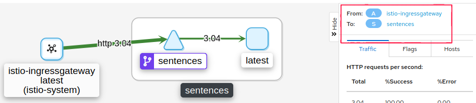
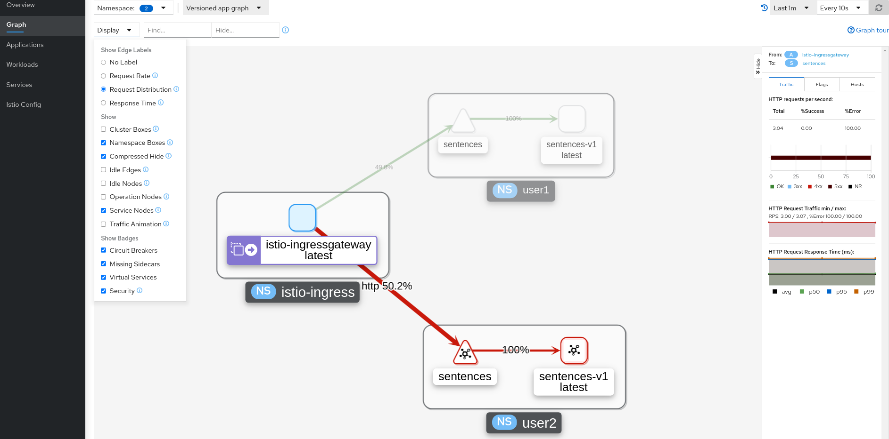
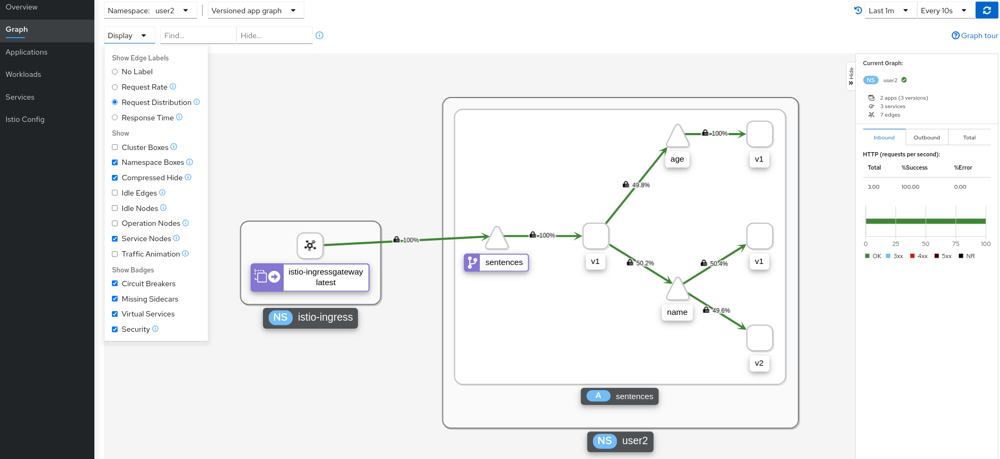
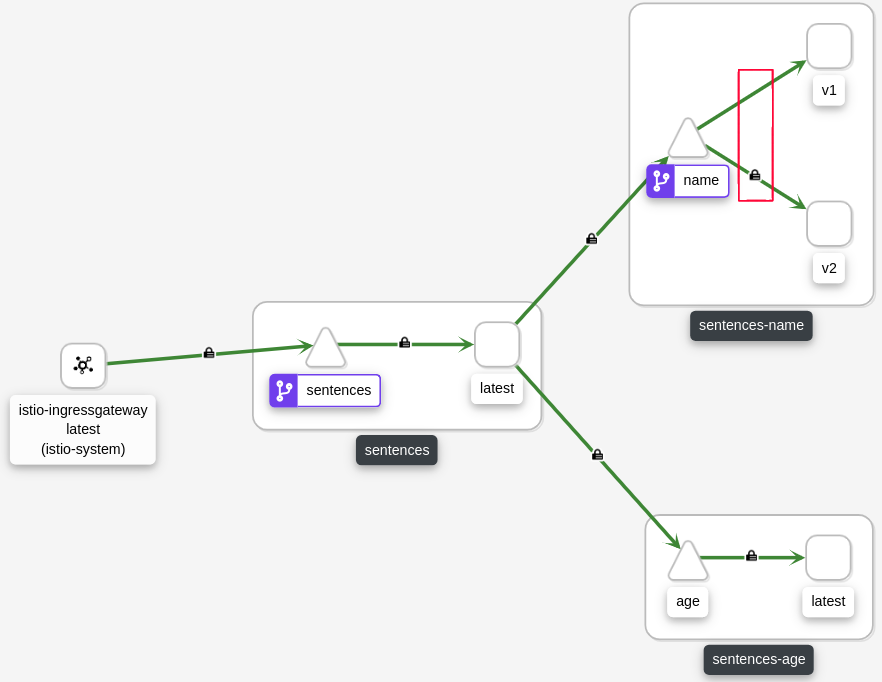
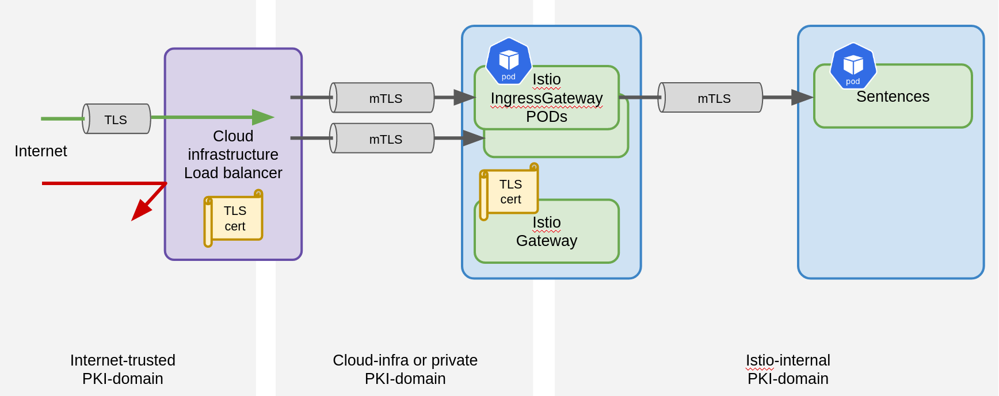

# Securing with Mutual TLS

This exercise will demonstrate how to use mutual TLS inside the mesh between
PODs with the Istio sidecar injected and also from mesh-external services
accessing the mesh through an ingress gateway.

## Mutual TLS Inside the Mesh

Deploy the sentences application:

```sh
kubectl apply -f deploy/mtls/
kubectl apply -f deploy/mtls/igw/gateway-http.yaml
kubectl apply -f deploy/mtls/igw/virtual-service-http.yaml
```

Execute `kubectl get pods` and observe that we have one container per POD, i.e. no Istio sidecars injected:

```
NAME                         READY   STATUS    RESTARTS   AGE
age-657d4d9678-q8h7d         1/1     Running   0          3s
name-86969f7468-4qfmp        1/1     Running   0          3s
sentences-779767c659-mlcm9   1/1     Running   0          4s
```

Execute the following to retreive sentences and thus update Istio metrics.

```sh
scripts/loop-query-loadbalancer-ep.sh
```

If we observe the result in Kiali, we will see that we only have information
about traffic from the ingress gateway towards the frontend sentences service
and that mTLS is not being used (later we will see how Kiali denotes that mTLS
is in use and be able to see the difference from this view).:



We now create a PeerAuthentication settings that require `STRICT` mTLS:

```sh
kubectl apply -f deploy/mtls/peer-auth/strict.yaml
```

We see, that traffic still flows, which is because the sentences services do not
have an Istio sidecar and the strict peer-authentication policy we created only
applies to the namespace where we created it and it is only applied when
validating requests made *towards* a workload with an Istio sidecar. I.e. even
if we created a strict policy in the namespace of the ingress gateway, traffic
would still flow.

Istio lets us define mTLS settings using these resource types:

- `PeerAuthentication` - What a sidecar accepts (ingress)

- `DestinationRule` - what type of TLS sidecar sends (egress)

Lets enable the Istio sidecar for the age service:

```sh
cat deploy/mtls/age.yaml |grep -v inject | kubectl apply -f -
```

After this we see, that traffic no longer flows. This is because the frontend
sentences service do not have an Istio sidecar and hence do not use mTLS towards
the `age` service which now require mTLS.

Inspect the result in Kiali - we see 100% errors:



While migrating an application to full mTLS, it may be useful to start with a
`PERMISSIVE` mTLS mode which allow a mix of mTLS and un-encrypted and
un-authenticated traffic.

Execute the following to restore traffic:

```sh
kubectl apply -f deploy/mtls/peer-auth/permissive.yaml
```

Next, observe the traffic in Kiali and try to explain why we see the disjoint
graph and what the source of the `unknown` traffic could be.

Hint: Which services have sidecars providing metrics for Kiali?

Lets inject Istio sidecars into all sentences services:

```sh
cat deploy/mtls/*.yaml |grep -v inject | kubectl apply -f -
```

Since all services now have an Istio sidecar, we can enable strict mTLS:

```sh
kubectl apply -f deploy/mtls/peer-auth/strict.yaml
```

Now we can see in Kiali, that mTLS is enabled between all services of the
sentences application (in the view below, the link between the frontend and the
`age` service has been selected):



To show how we can control egress mTLS settings with a DestinationRule, we
create one that use mTLS towards `v2` of the `name` service and no mTLS for
`v1`. Note that we now need to use a `PERMISSIVE` PeerAuthentication:

```sh
kubectl apply -f deploy/mtls/peer-auth/permissive.yaml
kubectl apply -f deploy/mtls/dest-rule/name.yaml
```

Note, that a DestinationRule *will not* take effect until a route rule
explicitly sends traffic to the subset, hence in `deploy/mtls/dest-rule.yaml` we
also define a VirtualService which routes to the subsets.

Now we see a missing padlock on the traffic towards `v1`:




## Mutual TLS from External Clients through Ingress Gateways

This exercise extends the server-side TLS we tried out in [exercise Multiple
Teams and Separation of Duties](multi-teams.md). Create a Certificate authority
and certificate as follows (or reuse the one from the previous exercise):

First, ensure that the gateway and virtual service from the first part of this
exercise is removed - we re-create them later with TLS enabled:

```sh
kubectl delete -f deploy/mtls/igw/gateway-http.yaml
kubectl delete -f deploy/mtls/igw/virtual-service-http.yaml
```

We must have the sentences application deployed with sidecars (this might
already be the case, unless you skipped some of the first part of this
exercise):

```sh
cat deploy/mtls/*.yaml |grep -v inject | kubectl apply -f -
```

Create the certificate authority:

```sh
openssl req -x509 -sha256 -nodes -days 365 -newkey rsa:2048 -subj '/O=example Inc./CN=example.com' -keyout example.com.key -out example.com.crt
openssl req -out sentences.example.com.csr -newkey rsa:2048 -nodes -keyout sentences.example.com.key -subj "/CN=sentences.example.com/O=ACMEorg"
openssl x509 -req -days 365 -CA example.com.crt -CAkey example.com.key -set_serial 0 -in sentences.example.com.csr -out sentences.example.com.crt
```

Also, since we will be using mTLS, we need to create a client certificate we can
use when accessing the sentences application through the ingress gateway:

```sh
openssl req -out client.example.com.csr -newkey rsa:2048 -nodes -keyout client.example.com.key -subj "/CN=client.example.com/O=ACMEorg"
openssl x509 -req -days 365 -CA example.com.crt -CAkey example.com.key -set_serial 1 -in client.example.com.csr -out client.example.com.crt
```

Create a kubernetes secret in the Kubernetes namespace in which the ingress
gateway is defined (see [exercise Multiple Teams and Separation of
Duties](multi-teams.md) for details on this):

```sh
export SENTENCES_INGRESSGATEWAY_NS=istio-system
kubectl -n $SENTENCES_INGRESSGATEWAY_NS create secret generic sentences-tls-secret --from-file=cert=sentences.example.com.crt --from-file=key=sentences.example.com.key --from-file=cacert=example.com.crt
```


```sh
kubectl -n $SENTENCES_INGRESSGATEWAY_NS apply -f deploy/mtls/igw/gateway.yaml
cat deploy/mtls/igw/virtual-service.yaml | envsubst | kubectl apply -f -
```

Finally, we query the sentences application using HTTPS and mTLS with the
following command:
```sh
scripts/loop-query-loadbalancer-ep.sh https+mtls
```

Note the curl options (printed when the script starts) that specify the
certificate authority and also the client certificate and key which is required
for mTLS:

### PKI Domains

PKI (Public Key Infrastructure) does not necessarily mean, that we are using
internet-scoped public/private key encryption. In this exercise we have seen how
we can leverage the Istio-internal PKI to implement mTLS inside the Istio mesh
between PODs with Istio sidecars. We have also seen how to setup mTLS for Istio
ingress gateways. For internet-accessible traffic, a likely cloud architecture
could be the following, where we have a load balancer in front of the ingress
gateways that implement internet-trusted TLS termination and DoS protection and
where we have mTLS between elements behind the load balancer. This provides
end-to-end protection of traffic.



## Cleanup

```sh
kubectl -n $SENTENCES_INGRESSGATEWAY_NS delete -f deploy/mtls/igw/gateway.yaml
cat deploy/mtls/igw/virtual-service.yaml | envsubst | kubectl delete -f -
kubectl delete -f deploy/mtls/peer-auth/permissive.yaml
kubectl delete -f deploy/mtls/dest-rule/name.yaml
kubectl delete -f deploy/mtls/
kubectl -n $SENTENCES_INGRESSGATEWAY_NS delete secret sentences-tls-secret
```
