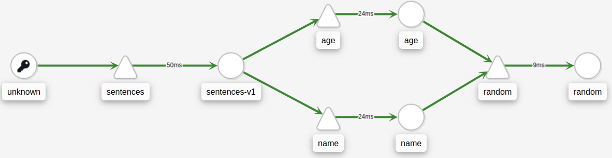
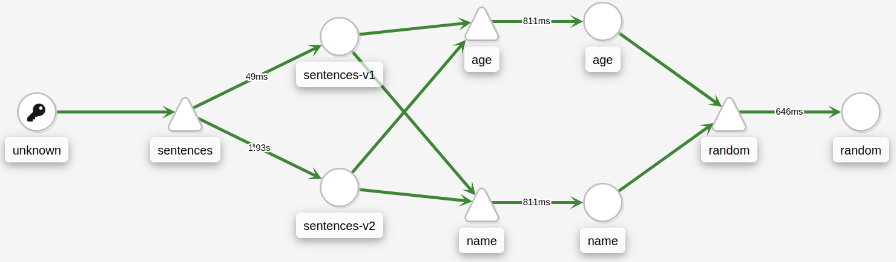
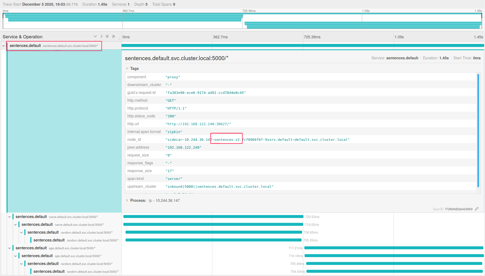

[//]: # (Copyright, Michael Vittrup Larsen)
[//]: # (Origin: https://github.com/MichaelVL/istio-katas)
[//]: # (Tags: #delay #network-delay #kiali #jaeger #tracing #distributed-tracing)

# Observing Delays in a Larger Application

In the exercise [Observing Delays](request-delays.md) we saw how we could
identify service delays when this was related to a specific service (or PODs if
we use labels). This was without any instrumentation in the application so this
is a nice possibility.

However, in larger application such an approach may prove more difficult. With a
larger application, multiple teams may be involved and e.g.:

- The misbehaving service might be owned by another team

- The misbehaving application might not be the immediate one from which you are
  observing a delay. In fact, it might be deep in the application tree

Istio and Jaeger can help us get a clearer picture on the problem.

First, deploy the following version of the `sentence` application - now with
three tiers to simulate a slightly more complex application:

```console
kubectl apply -f deploy/three-tiers/
```

In another shell, run the following to continuously query the sentence service
and observe the effect of deployment changes:

```console
scripts/loop-query.sh
```



Next, deploy `v2` of the `sentences` service:

```console
kubectl apply -f deploy/three-tiers/v2/
```

This version has a (simulated) bug, that cause large delays on the combined
service as we can see from the following Kiala application graph.



Now the SRE team for the `random` service is being paged, and they might find it
difficult to understand what have changed. Remember, the `sentences` service
might be developed by another team. How can the SRE team for `random` figure out
that they need to contact the responsible for `sentences` version `v2`?

If we search for traces in Jaeger where the trace time is high and inspect the
trace, we will find that the top-level service is indeed `sentences` version
`v2`:



# Cleanup

```console
kubectl delete -R -f deploy/three-tiers/
```