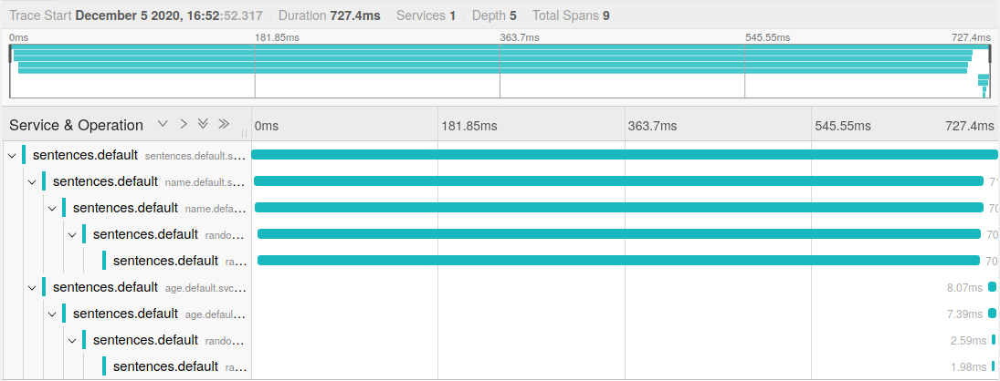

# Observing Delays in a Larger Application

In the exercise [Observing Delays](request-delays.md) we saw how we could
identify service delays when this was related to a specific service (or PODs if
we use labels). This was without any instrumentation in the application so this
is a nice possibility.

However, in larger application such an approach may prove more difficult. With a
larger application, multiple teams may be involved and e.g.:

- The misbehaving service might be owned by another team

- The misbehaving application might not be the immediate one from which you are
  observing a delay. In fact, it might be deep in the application tree

Istio and Jaeger can help us get a clearer picture on the problem.

First, deploy the following version of the `sentence` application - now with
three tiers to simulate a slightly more complex application:

```sh
kubectl apply -f deploy/three-tiers/
```

In another shell, run the following to continuously query the sentence service
and observe the effect of deployment changes:

```sh
scripts/loop-query.sh
```


```sh
kubectl apply -f deploy/three-tiers/v2/
```




# Cleanup

```sh
kubectl delete -R -f deploy/three-tiers/
```