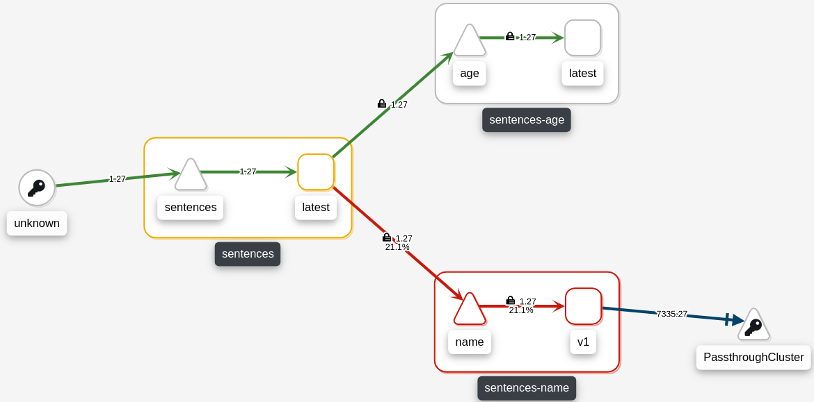
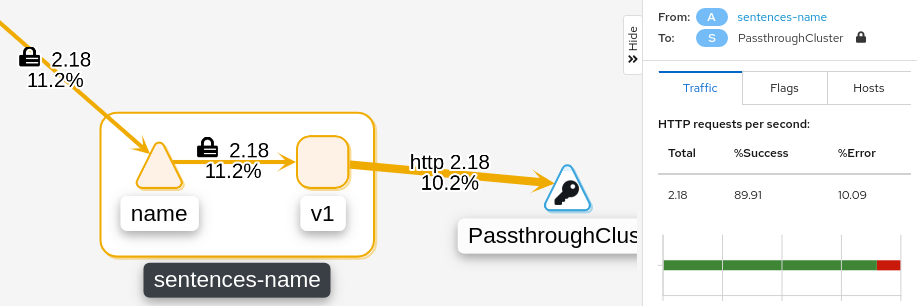

# When not to use TLS

```sh
kubectl apply -f deploy/no-tls/sentences.yaml
```

```sh
scripts/loop-query.sh
```

With this, we observe intermittent errors, however, if we observe the
application in Kiali, we see that the name service is failing but not that it is
caused by an downstream failure in the `random` service.



The reason why we cannot observe the failures in Kiali is that the application
is using HTTPS towards the `random` service (observe in the
`deploy/no-tls/sentences.yaml` file the value of
e.g. `SENTENCE_RANDOM_SVC_URL`). Because the HTTPS traffic is encrypted, the
Istio proxy cannot inspect the traffic and observe the failures. In Kiali we
also see the downstream traffic from the `name` service as being a `TCP
connection`.

Lets switch the downstream URL to HTTP instead of HTTPS:

```sh
kubectl apply -f deploy/no-tls/sentences-http.yaml
```




```sh
kubectl apply -f deploy/no-tls/service-entry-dest-rule.yaml
```

# Cleanup

```sh
kubectl delete -f deploy/no-tls/service-entry-dest-rule.yaml
kubectl delete -f deploy/no-tls/sentences.yaml

```
